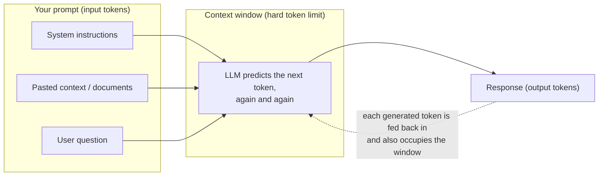

# Concepts — LLM Fundamentals, Tokens, and Context

You are about to spend twenty-two modules building an AI agent for TechCorp. Before writing a single API call, you need an honest mental model of the machine you'll be talking to. This module builds that model.

## What an LLM actually does

A **large language model (LLM)** is a program trained on enormous amounts of text to do one thing extremely well: given a sequence of text, predict what token comes next. It generates an answer one small piece at a time, each piece chosen based on everything that came before it — your instructions, your question, and the words it has already produced.

That's it. There is no database lookup, no reasoning engine bolted on the side, no memory of your last conversation. The remarkable behavior you see — answering questions, writing code, summarizing policies — emerges because *predicting text well* forces the model to internalize patterns of language, facts, and reasoning. Your instructions shape the prediction: change the input text, and you change what "comes next" most plausibly.

Two consequences matter for everything you'll build:

1. **The input text is the only lever you have at runtime.** What you put in the prompt is the whole game.
2. **The model predicts plausible text, not verified truth.** Grounding it in real documents is *your* job (Levels 2–3 of this course).

## Training knowledge vs. runtime context

An LLM has two completely different sources of information, and confusing them is the most common beginner mistake:

| | **Training knowledge** | **Runtime context** |
|---|---|---|
| What it is | Patterns baked into the model's weights during training | The text you send in this specific request |
| When it was set | Months or years ago, when the model was trained | Right now |
| Can it change? | No — frozen until the vendor trains a new model | Yes — you control it on every call |
| Knows TechCorp's refund policy? | No. TechCorp is (fictional and) private — it was never in the training data | Only if you paste the policy into the prompt |

The model has read a large fraction of the public internet, so it "knows" what a refund policy generally looks like. But it has never seen *TechCorp's* refund policy. If you want it to answer questions about TechCorp's documents, those documents — or the relevant parts of them — must travel inside the request, every single time. That is what "runtime context" means.

## Tokens: how the model reads text

Models don't read characters or words. They read **tokens** — chunks of text from a fixed vocabulary, produced by a **tokenizer**. Common words are usually one token; rarer words get split into pieces. Real output from the `cl100k_base` tokenizer (the one this module uses via the `tiktoken` library):

| Text | Tokens | Split |
|---|---|---|
| `apple` | 1 | `apple` |
| `apples` | 2 | `app` + `les` |
| `TechCorp` | 2 | `Tech` + `Corp` |
| `unbelievable` | 3 | `un` + `belie` + `vable` |
| `internationalization` | 2 | `international` + `ization` |
| `Sally has 14 apples.` | 7 | `S` + `ally` + ` has` + ` ` + `14` + ` apples` + `.` |

Notice that the splits are statistical, not linguistic — `apples` breaks in a place no dictionary would choose. A workable rule of thumb for English: **1 token ≈ 4 characters ≈ ¾ of a word**. Your lab code will use exactly this heuristic as a fallback when the real tokenizer isn't available.

### Input tokens vs. output tokens

Every request has two token counts, and providers bill them separately (output usually costs several times more per token than input):

- **Input tokens**: everything you send — system instructions, the user's question, any pasted documents, prior conversation turns.
- **Output tokens**: everything the model generates in response.

The shared `TokenUsage` schema in `src/techcorp_agent/schemas.py` tracks both, and `src/techcorp_agent/costs.py` turns them into dollars. Get in the habit now: **know what every request costs.**

## The context window

The **context window** is the maximum number of tokens — input *and* output combined — the model can handle in one request. It is a hard architectural limit, like RAM: typical models today offer somewhere between ~128 thousand and ~1 million tokens, and exceeding the limit is an error, not a graceful degradation.

Everything in that window competes for the model's attention, and every token in it costs money and processing time — whether it helps or not.

## Relevant vs. irrelevant context: the apple example

Here is the experiment you will run in this lab. Ask a model:

> Sally has 14 apples. Bob has 2 apples. How many apples do they have in total?

The answer is **16**. Now bury the same question in irrelevant-but-plausible facts:

> Apples come in red, green, and yellow varieties. Granny Smith apples are famously tart and bright green. Some people think Fuji apples are the sweetest of all. The skin of a Red Delicious apple is a deep crimson color. Honeycrisp apples are known for their satisfying crunch. **Sally has 14 apples. Bob has 2 apples. How many apples do they have in total?**

The answer is *still 16*. The apple trivia is on-topic (it's all about apples!) yet contributes nothing to the arithmetic. That extra text is **noise**, and noise is not neutral:

- It costs input tokens on every request — pure waste.
- It adds latency — the model must process every token.
- It dilutes attention — with enough distractors, models start latching onto the wrong numbers, hedging, or answering a different question than the one asked. Research on long contexts consistently shows accuracy dropping as irrelevant material grows, especially for facts buried in the middle.

**Irrelevant context is not free padding. It is an active liability.** The skill you're beginning to build — and that Levels 2–3 automate with retrieval — is sending the model *only* what the question needs.

## Trade-offs: latency, cost, and model size

There is no "best model," only fit for purpose. The dials you'll trade against each other all course long:

- **Bigger models** are generally more capable but slower per token and more expensive. A small model that answers a routing question correctly in 300 ms beats a frontier model that does it in 4 s at 20× the price.
- **More context** means higher cost (you pay per input token), higher latency (more tokens to process), and — past the point of relevance — *lower* accuracy. Context size is a budget to spend deliberately, not a bucket to fill.
- **Longer outputs** cost the most per token and stream slowly; `max_output_tokens` in `src/techcorp_agent/config.py` exists as a guardrail for exactly this reason.

## The punchline: why you can't just paste everything

So why not sidestep all of this by pasting TechCorp's entire document collection into every prompt?

Even this course's deliberately tiny teaching corpus — 17 documents in `data/` — is roughly 13,000 tokens. A real company's knowledge base (policies, tickets, wikis, contracts, order history) runs to millions of tokens: it simply **does not fit** in any context window. And even if it did fit:

- You would pay for every one of those tokens **on every single request** — answering "what is the refund window?" would cost as much as processing the whole company archive.
- Latency would be terrible.
- The apple experiment shows the quality cost: thousands of irrelevant paragraphs are the noise problem at industrial scale.

The correct move is to **retrieve** the handful of passages relevant to *this* question and send only those. Building that retrieval machinery — embeddings, vector search, RAG — is exactly what Level 2 of this course does. This module is the "why"; Level 2 is the "how."

## Common misconceptions

- **"More context is always better."** No. Relevant context is better; irrelevant context is noise that costs money, adds latency, and measurably degrades answers. You will demonstrate this yourself in the lab.
- **"The model remembers past chats by itself."** No. The model is stateless: each API request starts from nothing but the tokens you send. Chat apps *feel* like they remember because the application re-sends the conversation history inside every request — spending input tokens to do it. When you build memory in Module 15, *you* will be the one implementing that.
- **"The model knows our company's documents."** Only what was in its training data — which your private documents were not. Runtime context is the only way in.
- **"Token counts don't matter while I'm prototyping."** Habits formed at 100 tokens survive at 100,000. Cost, latency, and budget enforcement are cheapest to learn now.

## How this connects

- **Backward (Module 00):** you'll use the environment, the `techcorp_agent` package, and the offline mock client you set up there.
- **Forward (Module 02):** you'll make your first real API call and see these token counts on a live bill. **(Module 04)** prompt engineering is the craft of spending context tokens well. **(Modules 05–08)** retrieval solves the "can't paste everything" problem you just understood.

Now open [lab.md](lab.md) and prove all of this with code.
