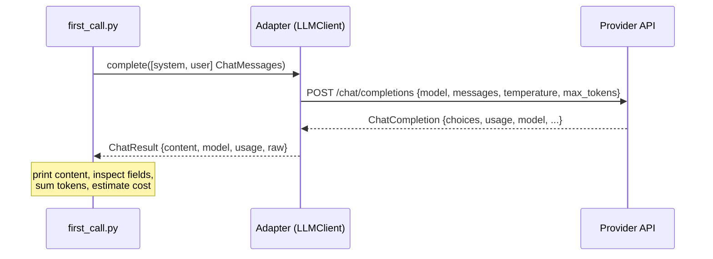

# Module 02 Concepts — Anatomy of an LLM API Call

In Module 01 you counted tokens locally with tiktoken and never left your machine. This module crosses the wire: your script sends a request to an LLM provider (or to our offline mock of one) and takes apart what comes back. Nothing here is framework magic — it is one HTTP request and one structured response, and you are going to know every field of both.

## 1. The four things every call needs

| Term | What it is | Where TechCorp keeps it |
|---|---|---|
| **API client** | The SDK object that turns your Python call into an HTTP request (auth headers, retries, JSON parsing). We use the `openai` SDK, which works with any provider exposing the `/chat/completions` API. | Created in `src/techcorp_agent/llm/openai_client.py` |
| **API key** | The secret that authenticates *you*. It is billing-critical and must never appear in code — only in the environment. | `OPENAI_API_KEY` in `.env`, loaded by `Settings` |
| **Base URL** | Which server to talk to. Blank means the provider's default (api.openai.com); pointing it at OpenRouter or a local Ollama (`http://localhost:11434/v1`) swaps providers without code changes. | `OPENAI_BASE_URL` in `.env` |
| **Model identifier** | Which model on that server, e.g. `gpt-4o-mini`. Model choice drives quality, latency, and — via per-token rates — cost. | `OPENAI_MODEL` in `.env` |

All four come from the environment through `techcorp_agent.config.Settings` (pydantic-settings reads `.env`). That is why the tests can assert **no key is hard-coded anywhere in this module**: a leaked key in a git repo is a real-world incident, not a style nit.

## 2. Roles: system, user, assistant

A chat request is not one string — it is a list of messages, each tagged with a role:

- **system** — standing instructions from the *application developer*: who the model is, what tone, what rules. Users never see or write this. Ours is `"You are TechCorp's internal assistant."` Convention (and our tests) put it first.
- **user** — what the *person* asked. There can be many of these in a longer conversation.
- **assistant** — what the *model* previously replied. You send these back on later turns so the model has conversational memory; the API itself remembers nothing between calls.

`techcorp_agent.schemas.ChatMessage` enforces exactly these three roles (`Role = Literal["system", "user", "assistant"]`), so an invalid role fails at construction time, not at the provider.

## 3. Request structure

The whole request is: model + messages + generation knobs.

```python
client.chat.completions.create(
    model="gpt-4o-mini",  # which model
    messages=[  # the conversation so far
        {"role": "system", "content": "You are TechCorp's internal assistant."},
        {
            "role": "user",
            "content": "In one sentence, what should I do when a customer asks for a refund?",
        },
    ],
    temperature=0.0,  # randomness dial
    max_tokens=1024,  # hard cap on the reply length
)
```



## 4. Response anatomy — it is a rich object, not a string

The single most common beginner mistake is treating the response as text. It is a structured object; the text is buried three levels deep:

```text
ChatCompletion
├── id                     request identifier (useful in support tickets)
├── model                  the model that actually served the request
├── choices: [             a LIST — may contain several, may be EMPTY
│     Choice
│     ├── index
│     ├── message
│     │     ├── role       "assistant"
│     │     └── content    the reply text — CAN BE None (e.g. tool calls, filters)
│     └── finish_reason    "stop" = finished naturally,
│                          "length" = hit max_tokens (reply is TRUNCATED),
│                          "content_filter" = provider refused
└── usage                  OPTIONAL token accounting
      ├── prompt_tokens        input side
      ├── completion_tokens    output side
      └── total_tokens         sum
```

`response.choices[0].message.content` works right up until it doesn't. Safe extraction acknowledges two facts the API contract allows:

- `choices` may be empty → guard before indexing;
- `message.content` may be `None` → coalesce to `""`.

```python
choice = response.choices[0] if response.choices else None
content = (choice.message.content or "") if choice else ""
```

This exact defensive pattern lives in `src/techcorp_agent/llm/openai_client.py`, and you reproduce it in the lab.

## 5. Usage fields — Module 01's tokens show up on the bill

`usage.prompt_tokens` is the provider counting the same thing you counted with tiktoken in Module 01 — every token of every message, roles and formatting included. `completion_tokens` is what the model generated. Input and output are counted separately because they are **priced** separately (output typically costs several times more).

Why can `usage` be absent? It is optional in the API contract: some OpenAI-compatible gateways and local servers omit it, and in streaming mode it only arrives if explicitly requested. Our normalized `ChatResult.usage` is therefore `TokenUsage | None`, and your code must survive the `None` case — "cost unknown" is an honest answer; a crash is not.

## 6. Basic cost calculation

Providers price per **million** tokens, with different input and output rates. So:

```text
cost_usd = (input_tokens × input_rate + output_tokens × output_rate) / 1_000_000
```

That is all `techcorp_agent.costs.estimate_cost_usd` does. The rates live in `.env` (`COST_INPUT_PER_MTOK`, `COST_OUTPUT_PER_MTOK`) because every provider and model prices differently — hard-coding today's price sheet guarantees wrong numbers next quarter. The number matters less than the habit: from this module onward, every TechCorp request knows roughly what it cost.

## 7. Error taxonomy — three different failures, three different fixes

"The API call failed" is useless in a log at 2 a.m. The SDK distinguishes the failure modes, and our adapter converts each into a `ProviderError` whose message says what to *do*:

| Failure | SDK exception | What it means | The fix |
|---|---|---|---|
| Authentication | `AuthenticationError` (HTTP 401) | The server answered: your key is wrong/expired/for another endpoint | Fix `OPENAI_API_KEY` in `.env` |
| Network | `APIConnectionError` (no HTTP response at all) | Never reached a server: DNS, proxy, offline, bad `OPENAI_BASE_URL` | Fix connectivity / `OPENAI_BASE_URL` |
| Status | `APIStatusError` (other 4xx/5xx) | Server answered with an error: 404 unknown model, 429 rate limit, 5xx outage | Fix `OPENAI_MODEL`, slow down, or wait |

Application code catches one exception type (`ProviderError`) and prints an actionable message — the taxonomy lives in the adapter, once.

## 8. Adapter vs raw SDK

This module deliberately shows both layers:

- `solution/first_call.py` — application code against **our adapter** (`techcorp_agent.llm`). It works offline via the mock client and never imports the vendor SDK.
- `solution/raw_sdk_demo.py` — the identical call against the **raw `openai` SDK**, guards and all. Read them side by side: everything the demo does by hand (client construction, defensive extraction, error mapping) is what the adapter does for every future module. In Module 03 a third layer appears — LangChain — and you will be able to judge exactly what that abstraction buys and costs.

## Common misconceptions

- **"The response is a string."** It is an object; the string is at `choices[0].message.content`, and both hops can fail. Print the whole object once and look.
- **"`choices[0]` always exists and `content` is always text."** Both are allowed to be empty/`None` by the contract. Guard them.
- **"`usage` is always there."** Optional. Handle `None`.
- **"temperature=0 makes output fully deterministic."** It makes it *nearly* deterministic — providers may still vary slightly between runs (hardware, model updates). It removes most randomness, not all guarantees.
- **"max_tokens makes the model write concisely."** No — it is a chainsaw, not an editor. The model writes as if unlimited and gets cut off mid-sentence; the evidence is `finish_reason == "length"`.
- **"The API remembers my previous messages."** Stateless. Memory is you re-sending the history as `assistant`/`user` messages (and paying input tokens for it every turn).

## Trade-offs to internalize

- **Temperature 0 vs higher.** 0 → repeatable, testable, boring: right for scripted internal tools and anything under test. Higher (0.7–1.0) → varied and sometimes better prose, but unrepeatable — a bug you can't reproduce. Default to 0; raise it deliberately. The lab's stretch exercise makes this visible.
- **max_tokens: cap vs truncation.** A low cap bounds cost and latency per request (it caps *output*, the expensive side) but risks truncated answers. A high cap risks paying for rambling. Set a ceiling that fits the task and check `finish_reason` to know when you hit it.
- **Adapter vs raw SDK.** The raw SDK exposes every provider feature immediately; the adapter costs a thin layer of indirection but buys offline testing, one error type, and provider swaps via `.env`. TechCorp pays the indirection.

Next: [lab.md](lab.md) — build it.
