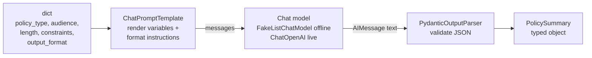

# Concepts — LangChain Fundamentals

## Why abstractions exist

By the end of Module 02 you had already written real integration code: convert
messages to the provider's wire format, call the SDK, unwrap the response,
normalize usage numbers, translate errors into actionable messages. That code
was maybe eighty lines — and none of it was TechCorp's actual product.

Now multiply it. Different providers, retries, streaming, prompt reuse, output
validation, tool calls, tracing. Every AI team ends up writing the same
plumbing, and abstractions exist to write it once. You did it at a small scale
yourself: `techcorp_agent.llm.base.LLMClient` is an abstraction. LangChain is
the same move made by a whole ecosystem.

Two definitions this course uses from here on:

> **LLM** — a component that generates output from instructions and context.
>
> **Agent** — a system that can decide which actions, tools, or retrieval
> steps to use to complete a request.

Nothing in this module is an agent yet. A prompt template feeding a model
feeding a parser makes zero decisions — the developer fixed every step. Agents
arrive when the *model's output* starts choosing the next step (Module 10
onward). Keeping these two ideas separate will save you from a lot of
marketing fog.

## Direct SDK versus LangChain

The same request, two stacks:

```python
# Module 02 — our adapter over the raw SDK
result = client.complete(
    [
        ChatMessage(role="system", content=SYSTEM_PROMPT),
        ChatMessage(role="user", content=question),
    ]
)
answer = result.content

# Module 03 — LangChain's chat-model interface
reply = model.invoke([SystemMessage(SYSTEM_PROMPT), HumanMessage(question)])
answer = reply.text
```

What the framework **saves** you:

- Provider adapters you did not write: swap `ChatOpenAI` for another
  provider's chat model and the calling code stays identical.
- A shared vocabulary of composable parts — prompts, models, parsers,
  retrievers — that plug into each other and into later course tools
  (LangGraph in Module 10 speaks the same interfaces).
- Batteries: prompt templating, output parsing, streaming, retries, fake
  models for testing, callbacks/tracing.

What the framework **hides**:

- The actual HTTP request. Token limits, provider-specific parameters, and
  error semantics are still there — just behind more layers. When something
  breaks, you debug through LangChain *and* the provider.
- Cost. `model.invoke(...)` looks like a free function call. It is a paid
  network round trip, exactly like Module 02's — the pipe operator does not
  change your bill.
- Version churn. LangChain moves fast; imports and APIs get reorganized
  between major versions. Your own eighty-line adapter never breaks on a
  framework release — that is genuinely a point in its favor.

## Model-provider adapters — two altitudes, same pattern

Compare the abstraction you already own with the one you are adopting:

| | `techcorp_agent.llm` (Module 02) | LangChain |
| --- | --- | --- |
| Interface | `LLMClient.complete(messages) -> ChatResult` | `BaseChatModel.invoke(messages) -> AIMessage` |
| Message type | `ChatMessage(role=..., content=...)` | `SystemMessage` / `HumanMessage` / `AIMessage` |
| Offline stand-in | `MockLLMClient(responses=[...])` | `FakeListChatModel(responses=[...])` |
| Provider swap | write a new class implementing the protocol | install `langchain-<provider>`, change one constructor |
| Scope | one method, ~80 lines, ours | prompts, parsers, runnables, tools, a whole ecosystem |

Both are **adapters**: application code depends on a stable interface, and
provider-specific mess stays behind it. The difference is altitude. Ours is a
hand-built footbridge — small, fully understood, ours to maintain. LangChain
is a highway system — enormously more reach, but you did not pour the
concrete, and the road layout changes between releases. This module's Lab A
exists so you can judge the trade personally, not take either side on faith.

## Prompt templates

A prompt with values hardcoded into an f-string is a one-off. A
`ChatPromptTemplate` is a *function over variables* — reusable, testable, and
strict:

```python
prompt = ChatPromptTemplate.from_messages([
    ("system", "You are TechCorp's internal policy writer. ..."),
    ("user", "Draft a {policy_type} policy for {audience}. ..."),
])
messages = prompt.format_messages(policy_type="remote work", audience="engineers", ...)
```

Two properties matter:

- `prompt.input_variables` is machine-readable — tests can assert the template
  requires exactly the variables it should.
- A missing variable raises `KeyError` at render time instead of silently
  sending `{audience}` to the model. Fail loudly beats fail politely.

## Output parsers

Models return text. Applications want data. An output parser is the seam
between the two:

```python
parser = PydanticOutputParser(pydantic_object=PolicySummary)
parser.get_format_instructions()  # text you embed in the prompt: "reply as JSON matching this schema..."
parser.parse(reply.text)  # -> PolicySummary, or a loud validation error
```

The parser plays both ends: it *tells the model* what shape to produce (format
instructions go into the prompt) and *refuses to accept* anything that does
not validate. Downstream code gets `summary.key_rules: list[str]`, never
"hopefully JSON-ish text".

Live providers offer a stronger mechanism —
`model.with_structured_output(PolicySummary)` uses the provider's native
JSON/function-calling mode instead of prompt instructions. It is more reliable
but provider-dependent; the parser approach works with any model, including
our offline fake. This course teaches the parser first for exactly that
reason.

## Runnable composition — the `|` pipe

Prompt, model, and parser each implement the same tiny contract: `invoke(input)
-> output`. Anything with that contract is a **Runnable**, and `|` chains them
by feeding one's output into the next:

```python
chain = prompt | model | parser        # a new Runnable
summary = chain.invoke({"policy_type": "remote work", ...})   # -> PolicySummary
```



One `invoke` on the chain runs render → generate → validate. The composed
chain is itself a Runnable, so it can become a stage inside a bigger chain —
that recursive property is what LangGraph builds on later.

## Common misconceptions

- **"LangChain calls the model for free."** No. The middle of every chain is
  the same paid, rate-limited, sometimes-failing network call you made in
  Module 02. The pipe syntax hides the round trip; it does not remove it.
- **"With a framework I don't need to understand the API anymore."** The
  opposite: when a chain misbehaves you now debug the provider's behavior
  *through* the framework's layers. Module 02 knowledge is what makes
  LangChain errors readable.
- **"A chain is an agent."** A chain is a fixed pipeline — every step was
  decided by you at build time. See the definitions above: no decisions, no
  agent.
- **"The parser guarantees the model returns valid JSON."** It guarantees you
  *detect* invalid output. The model can still ramble; then the parser raises.
  Handling that failure (retry, reprompt, native structured output) is your
  job.

## Practical trade-offs

- **Convenience vs opacity.** Three lines of pipe replace thirty lines of
  plumbing — and put three library layers between you and the stack trace.
  For standard shapes (prompt→model→parser) take the convenience; for unusual
  provider features, dropping to the SDK can be simpler than fighting the
  abstraction.
- **Ecosystem vs version churn.** LangChain's breadth is real, and so are its
  breaking releases. Pin versions, and keep your own thin seams (like
  `get_lc_model` in this module) so upgrades touch one file, not every lab.
- **Portability vs provider features.** The common interface covers what all
  providers share. The newest provider-specific capability usually appears in
  the raw SDK first and in the framework later — visibility you lose behind
  the adapter.
- **Prompt-based parsing vs native structured output.** Format instructions
  work everywhere (including offline) but rely on the model following text
  instructions. `with_structured_output` is stronger but provider-specific and
  untestable without credentials. Use the first to learn and test, the second
  in production when your provider supports it.
