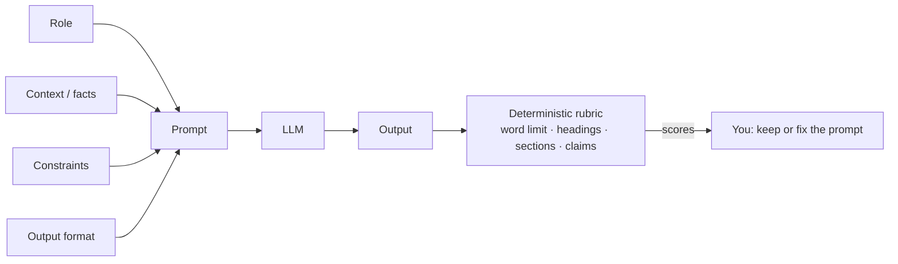

# Module 04 Concepts — Prompt Engineering

You have called models directly (Module 02) and through LangChain (Module 03).
In both cases the *prompt* — the text you send — was the single biggest lever
on output quality, and you pulled it by intuition. This module makes that
lever an engineering discipline: prompts become functions you version, test,
and score.

Why it exists: an LLM has no access to your intent, only to your text. Every
detail you leave out, the model fills in with a plausible guess — and at
TechCorp, "plausible guess" in a GDPR policy or a customer refund answer is a
liability. Prompt engineering is the practice of moving requirements out of
your head and into the prompt, where the model can see them and your tests
can check them.

## The anatomy of a working prompt

Five ingredients turn "Write a policy." into something a model can execute
reliably:

1. **Specificity** — name the exact task. Not "a policy" but "a customer data
   retention policy". Vague requests give the model a huge answer space;
   whatever it picks will look confident and be arbitrary.
2. **Role instructions** — who is speaking? "You are a policy writer at
   TechCorp, a consumer electronics company" anchors vocabulary, formality,
   and perspective far more cheaply than describing all three.
3. **Context** — the facts the answer must be built from: the audience is
   European customers, the regulation is GDPR, the retention period is 30
   days. If a fact isn't in the prompt (or retrieved into it — Module 08),
   the model can only invent it.
4. **Constraints** — the boundaries: a 200-word limit, "use only the facts
   given here", "do not invent details". Constraints are what make an output
   *checkable*: you can't test "make it good", but you can test "≤ 200 words".
5. **Output format** — the shape: required headings (Purpose / Scope /
   Retention / Your Rights), labeled sections, bullets, JSON. Format is what
   lets *code* consume the output downstream — the reason every later module
   in this course can parse model responses at all.

## Zero-shot, one-shot, few-shot

A **"shot"** is one worked example of the task — a sample input/output pair
(or a sample output) placed *inside the prompt* so the model can imitate it.
The count of examples names the technique:

- **Zero-shot** — no examples. You describe the task and trust the model's
  general training: "Write a remote-work policy." Cheapest, and fine for
  tasks the model has seen a million versions of.
- **One-shot** — one example. Ideal for *structure transfer*: show one
  refund policy with its headings, then ask for a remote-work policy "with
  the same organization". Describing a structure in words is hard; showing
  it once is easy.
- **Few-shot** — several examples (typically 3–5). Ideal for *style and
  convention transfer*: three exemplar TechCorp support replies teach the
  tone, empathy, format, and escalation-rule habits far better than a
  paragraph of adjectives ("be empathetic but professional…") ever does.
  Multiple examples also show the model what *varies* between cases and what
  stays fixed.

## Step-based decomposition

Big fuzzy tasks ("review this policy for GDPR compliance") produce big fuzzy
answers: judgments, observations, and advice blended into one paragraph you
can neither verify nor act on. **Decomposition** splits one complex request
into explicitly labeled steps inside a single prompt, each producing its own
output:

1. Applicable Requirements
2. Current-Policy Observations
3. Gaps
4. Recommendations
5. Implementation Steps

Each section builds on the previous ones — a gap must name the requirement
and the observation it conflicts with — so errors become visible at the step
where they happen, and each step is independently checkable.

**Important boundary:** do *not* ask the model to reveal its private hidden
reasoning ("show me your internal chain of thought"). That is neither
reliable nor necessary. Instead, ask for things that are legitimate *outputs*
you can verify:

- a **concise plan** before the answer ("first list the sections you will write"),
- **explicit intermediate outputs** (the five labeled sections above),
- **checkable calculations** ("show the word count / the arithmetic, not the musing"),
- a **structured rationale** ("for each gap, cite the requirement and observation it traces to"),
- the **evidence used** ("quote the policy sentence each observation comes from").

You get everything auditability requires, and every piece of it is text you
can score with code.

## Evaluating prompts with a deterministic rubric

If you change a prompt and "it seems better", you know nothing. This module's
rubric is plain Python — word counts, substring checks, number matching — so
every score is reproducible and explainable. It measures proxies:
constraint following (word limit), structure (headings, sections), and an
*approximate* unsupported-claims check (numbers in the output must appear in
the provided context). It cannot measure whether a policy is *wise* — that
still takes a human, or the carefully-evaluated model judges of Module 19.
Cheap deterministic checks first, expensive judgment later, is a pattern this
course repeats.

## Common misconceptions

- **"Magic words fix everything."** There is no incantation ("act as an
  expert", "take a deep breath", "I'll tip $200") that substitutes for
  missing facts and constraints. Phrasing tweaks move quality a little;
  supplying the context, constraints, and format the task actually needs
  moves it a lot — and only the latter survives model upgrades.
- **"A longer prompt is a better prompt."** Length is a cost, not a virtue.
  Every token adds price and latency, and irrelevant detail actively dilutes
  the instructions that matter. The vague prompt in Lab A fails because it's
  missing *requirements*, not paragraphs; the fix adds five precise
  constraints, not five hundred words.
- **"Examples are just decoration."** Shots are the most direct way to
  specify format and style; models follow demonstrated patterns more
  faithfully than described ones.
- **"A good prompt guarantees a good answer."** It raises the floor and the
  average. Outputs still vary — which is exactly why the rubric exists, and
  why later modules add grounding (08–09) and guardrails (20).

## Practical trade-offs

- **Few-shot token cost vs consistency gain.** Our three support exemplars
  add roughly 400 tokens to *every single request* — a real per-call cost in
  money and latency at support-ticket volume. In exchange, output format
  becomes consistent enough for code to rely on. Rule of thumb: pay for shots
  when downstream code or brand voice depends on consistency; go zero-shot
  for one-off tasks, and use the fewest examples that hold the format.
- **Tight constraints vs model flexibility.** A 200-word limit and fixed
  headings make output checkable but can force awkward compression; leave
  slack where precision doesn't matter.
- **Decomposition vs simplicity.** Five labeled sections give traceability
  but produce longer outputs and more instructions to maintain. Don't
  decompose a task a single instruction handles.
- **Deterministic rubric vs judgment.** Code checks are free, fast, and
  honest about what they measure — and blind to everything else. They are a
  floor, not a verdict.

Next module: prompts tell the model *how* to answer; embeddings (Module 05)
begin the machinery for finding *what* facts to put in the prompt.
