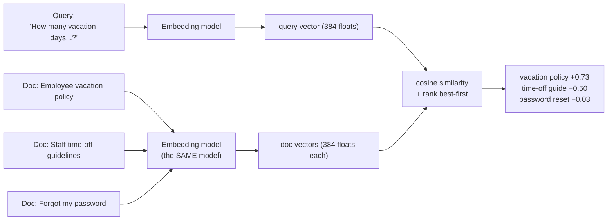

# Concepts — Embeddings: How Meaning Becomes Geometry

Module 01 left you with a problem you couldn't solve yet. TechCorp's documents don't fit in a context window, so you must *retrieve* only the passages relevant to each question — but how does a program know that a document about "Staff time-off guidelines" is relevant to the question "How many vacation days do I get?" when the two share almost no words? This module is the answer.

## The problem: same meaning, different words

Look at these two pairs:

- **"Employee vacation policy"** vs **"Staff time-off guidelines"**
- **"Forgot my password"** vs **"Account recovery"**

Each pair means nearly the same thing. Now count shared words: the first pair shares *zero* ("employee/staff", "vacation/time-off", "policy/guidelines" — three synonyms, no overlaps). The second pair also shares zero. A keyword search for "vacation" will never find the time-off document; a search for "password" will never find the account-recovery page.

This is not an edge case — it's the *normal* case. People ask questions in their own words, and documents are written in someone else's. English has too many ways to say the same thing for exact word matching to work. Retrieval by *wording* fails; we need retrieval by *meaning*.

## Embeddings: text as a point in space

An **embedding** is a list of numbers — a **vector** — produced by a neural network from a piece of text. The model this course uses (`sentence-transformers/all-MiniLM-L6-v2`) turns any text into exactly **384 floats**:

```text
"Employee vacation policy"  →  [+0.0114, +0.0585, +0.0753, -0.0320, +0.0050, ... 379 more]
```

The count of numbers (384 here) is the vector's **dimension**. Think of each vector as a point in a 384-dimensional space. No single number means anything readable on its own ("dimension 17 is not 'sportiness'") — what matters is the *position of the whole point*, because the model was trained on an enormous amount of text with one objective: **texts with similar meaning land close together; texts with different meanings land far apart.**

That's the whole trick. Meaning — fuzzy, human, hard to define — becomes **geometry**: distances and angles between points, which computers handle effortlessly.

### The connection to Module 01

In Module 01 you learned that models read **tokens**, not words — text chopped into vocabulary chunks. Inside every LLM, the very first step after tokenization is looking up a vector for each token; the network then mixes those vectors together through its layers. An embedding model is that same machinery, cut short: instead of predicting the next token, it pools the processed token vectors into **one vector for the whole text**. Embeddings aren't a new idea bolted onto LLMs — they are the *representation LLMs already think in*, exposed as an output. Tokens are how text gets in; embeddings are how meaning becomes geometry.

## Cosine similarity: measuring "close"

To compare two vectors we use **cosine similarity**: the cosine of the angle between them.

- **+1.0** — same direction: (near-)identical meaning.
- **around 0** — unrelated meanings.
- **−1.0** — opposite direction (rare in practice for sentence embeddings; scores below 0 just mean "very unrelated").

Cosine compares *direction* and ignores vector length, which is why it's the standard choice for text embeddings (a long document and a short phrase can still point the same way). The course helper is already built: `techcorp_agent.similarity.cosine_similarity`, plus `rank_by_similarity` which scores a query vector against many candidates and sorts best-first.

Real numbers from this module's lab (all-MiniLM-L6-v2):

| Pair | Cosine | Shared words |
|---|---|---|
| "Employee vacation policy" vs "Staff time-off guidelines" | **+0.446** | none |
| "Forgot my password" vs "Account recovery" | **+0.518** | none |
| "Employee vacation policy" vs "Forgot my password" | +0.039 | none |
| "Staff time-off guidelines" vs "TechCorp quarterly revenue report" | +0.073 | none |

Four pairs, all with zero word overlap — yet the model cleanly separates the two same-meaning pairs (≈0.45–0.52) from the two different-meaning pairs (≈0.04–0.07). *That* separation, invisible to any keyword matcher, is what you're buying with embeddings. Note the absolute values are model-specific: 0.45 is a strong score for this model; don't memorize thresholds, compare *rankings*.



## Rule: one index, one model — always

Vectors are only comparable if they come from **the same embedding model**. Each model lays out its space differently (and often with a different dimension entirely) — a vector from model A compared against a vector from model B is meaningless noise, even when the dimensions happen to match. Practical consequences:

- If you embed your documents with model X, every future query must be embedded with model X.
- Changing the embedding model means **re-embedding the entire document collection** — a real migration cost you'll feel in Module 07 when vectors live in a database.
- Record the model name next to any stored vectors. (The clients in this repo expose `.model_name` for exactly this reason.)

## The two embedding clients in this repo

Both implement the same `EmbeddingClient` protocol (`src/techcorp_agent/embeddings/base.py`): a `model_name`, a `dimension`, and `embed(texts) -> vectors`. They could not be more different inside:

| | `SentenceTransformerClient` | `HashEmbeddingClient` |
|---|---|---|
| File | `embeddings/st_client.py` | `embeddings/hash_client.py` |
| How it works | Real neural network (all-MiniLM-L6-v2) running locally | Hashes each word/bigram into a bucket, counts, normalizes |
| Semantics? | **Yes** — trained on meaning | **No** — word overlap only |
| "vacation" ≈ "time off"? | Yes (≈0.45) | No (~0.0 — no shared words) |
| Cost | Free; one-time ~90 MB download, then fully local | Free, zero downloads |
| Deterministic? | Yes for a given model version | Yes, bit-for-bit, forever |
| Used for | The actual lab, Modules 06–08, the capstone | **Tests** and `TECHCORP_OFFLINE=true` |

Why does the hash client exist at all if it has no semantics? Because tests must run on any machine, instantly, with no network — and shape/ordering/symmetry logic can be verified with *any* deterministic client. The hash client tests the plumbing; the sentence-transformer model provides the meaning. Don't confuse the two: if your similarity scores look like pure word-counting, check which client you're on (the lab prints `model_name` for exactly this reason).

`get_embedding_client()` in `embeddings/factory.py` picks for you: the real model normally, the hash client when `TECHCORP_OFFLINE=true`. Note the asymmetry with the LLM factory from Module 02 — a missing API key does *not* force the hash client, because embeddings are local and free anyway.

## Trade-offs

- **Semantic vs keyword search.** Embeddings find meaning across wording; keyword matching is literal. But keyword matching is not useless — it's cheaper, trivially explainable ("matched on 'vacation'"), and *better* for exact identifiers (error codes, order numbers, product SKUs — an embedding model may consider `ORD-7841` and `ORD-7814` nearly identical!). Production systems often combine both ("hybrid search", Module 17). This module teaches the failure modes of each, not a winner.
- **Dimension vs cost.** More dimensions can encode finer distinctions, but every vector costs storage and every comparison costs compute, in proportion. 384 (MiniLM) is a sweet spot for learning; production models range from ~256 to ~3072.
- **Local model vs API embeddings.** This course's model runs locally: free, private, offline after one download. Hosted embedding APIs offer stronger models with zero setup — at per-token cost, a network round-trip per batch, and vendor lock-in of your entire index (see the one-index-one-model rule: switching means re-embedding everything).
- **Whole-text vector vs detail.** One vector summarizes the *whole* text. Embed an entire 40-page handbook into one vector and every specific fact blurs into an average. That's why real pipelines embed *chunks* — the subject of Modules 06–07.

## Common misconceptions

- **"Similar words ⇒ similar vectors."** Backwards in both directions. "Forgot my password" and "Account recovery" share no words yet sit close; "Vacation photo contest" shares two words with a vacation-policy query yet is about something else entirely. The lab makes you catch both cases (they're keyword matching's false negative and false positive).
- **"Individual dimensions mean something."** No. Meaning is distributed across all 384 numbers; only whole-vector comparisons (angles, distances) are meaningful. Nobody can tell you what dimension 200 encodes.
- **"A cosine of 0.45 is a weak match."** Scores are model-relative. For all-MiniLM-L6-v2, unrelated short phrases score near 0, so 0.45 is a *strong* signal. Judge scores against each other (rankings, or a threshold you calibrate in Module 06), never against an imagined universal scale.
- **"Vectors from different models are roughly compatible."** Never. Not even different versions of the "same" model. One index, one model.
- **"Embeddings understand text like an LLM does."** An embedding is a fixed summary, not a reasoning engine. It can say two texts are *about the same thing*; it cannot answer questions, follow instructions, or notice a negation reliably ("refunds are allowed" vs "refunds are not allowed" embed uncomfortably close). Retrieval finds candidates; the LLM still does the reading (Module 08).
- **"The 2D plot shows the real layout."** A 2D projection of a 384-dimensional space *must* throw away almost everything (PCA keeps the two most spread directions out of 384). Points that look close in the plot may be far apart in the real space, and vice versa. Use plots for intuition, never for conclusions — compute cosine on the full vectors.

## How this connects

- **Backward (Module 01):** tokens showed you how text gets *into* a model; embeddings are how the model's sense of meaning gets *out* — and they're the escape hatch from the "can't paste everything" problem.
- **Backward (Module 04):** prompt engineering optimized what you say to the model; from here on, retrieval decides what *evidence* travels with it.
- **Forward (Module 06):** you'll wrap today's loop — embed, compare, rank — around real TechCorp documents with chunking, top-k, and thresholds: semantic search.
- **Forward (Modules 07–08):** the vectors move into a real vector database (Chroma), then feed a full RAG pipeline where retrieved chunks ground the LLM's answers.

Now open [lab.md](lab.md) and turn meaning into numbers yourself.
