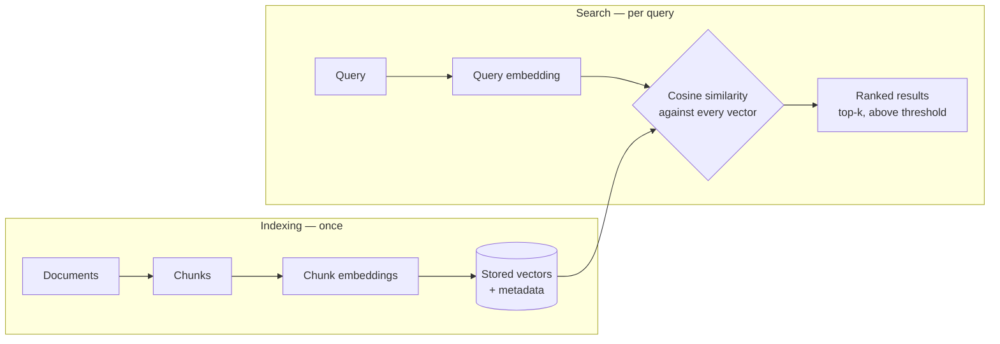

# Module 06 Concepts — From Embeddings to a Search Engine

In Module 05 you embedded individual sentences and compared them pairwise. That was a party trick. This module makes it useful: embed an entire document corpus *once*, then answer arbitrary questions against it in milliseconds. The result is a semantic search engine — the retrieval half of every RAG system you will build from Module 08 onward.

## 1. The complete search pipeline

Two phases, and it matters which work happens in which:

```text
Documents → chunks → embeddings → stored vectors        (indexing: once, offline)
Query → query embedding → similarity comparison → ranked results   (search: per query)
```



**Indexing** is the expensive part: load every document, split it into chunks, embed every chunk (one batched model call, not one per chunk), and store the vectors next to the chunks. It happens once, ahead of time.

**Search** is cheap: embed the query (one short text), compute cosine similarity against every stored vector, sort, and return the best few. In this module "store" means two parallel Python lists and "compare against every vector" means exactly that — a brute-force loop. For 13 documents (~70 chunks) that is instant, and having no black box is the point. Module 07's vector database changes *where* vectors live and *how fast* the comparison is at scale; it changes nothing about this picture.

One rule carried over from Module 05 and worth repeating: **query and documents must be embedded by the same model**. Vectors from different models live in different spaces; comparing them is meaningless, not just inaccurate.

## 2. Chunks, not documents

We embed chunks (from Module 05's `chunk_document`), not whole documents, for two reasons:

- **Precision of meaning.** One vector summarizes one text. A whole policy document covers stipends, core hours, and compliance — its single vector is a blurry average of all three. A paragraph about the home-office stipend embeds to a sharp point.
- **Downstream use.** In Module 08 the retrieved text goes into an LLM prompt. You want to send the two relevant paragraphs, not the entire employee handbook.

Each chunk keeps its `Chunk` metadata: `doc_id`, `doc_title`, `category`, position `index`. The vector finds the chunk; the metadata tells you (and later, the LLM's citations) where it came from.

## 3. Top-k retrieval

A similarity search never answers "which chunks match?" — every vector has *some* cosine similarity to the query. It answers "which k chunks match **best**?" You choose k:

- **k too small (1):** one bad ranking and the right answer is simply absent. Multi-part answers (refund options *and* refund timing) get truncated.
- **k too large (20):** the right chunk is in there, buried under 19 distractors — which costs tokens, latency, and (in Module 08) gives the LLM more opportunities to quote the wrong paragraph.

`top_k=3` is this module's default: enough redundancy to survive an imperfect ranking, small enough to read. There is no universally correct k — it is your first retrieval tuning knob.

## 4. Similarity scores and thresholds

Every result carries its cosine score (`RetrievedChunk.score`). Two separate uses:

- **Ordering** (relative): 0.55 beats 0.43, return it first. This always works.
- **Judging** (absolute): "is 0.43 actually *relevant*, or just the least-irrelevant chunk we had?" This needs a **threshold** (`min_score`): results below it are dropped, and an empty list is a legitimate answer.

Thresholds exist because top-k alone has a failure mode: it always returns k results, *even when nothing in the corpus is relevant*. Ask TechCorp's corpus "How do I recover my account?" — no such policy exists — and top-3 cheerfully returns data-deletion chunks at ~0.35. Without a threshold, that lands in an LLM prompt and becomes a confident wrong answer about deleting the user's account.

Calibrate honestly: score ranges depend on the embedding model, so eyeball your own scores first. With `all-MiniLM-L6-v2` on this corpus, on-topic hits land roughly 0.45–0.70 and off-topic noise 0.25–0.40 — a threshold near 0.40 separates them decently. Those numbers are corpus-specific observations, not constants.

## 5. Precision and recall intuition

The two words you need for every retrieval conversation from here to Module 17:

- **Precision** — of what I returned, how much was relevant? (Low precision = noise.)
- **Recall** — of what was relevant, how much did I return? (Low recall = missed answers.)

The knobs trade one against the other:

| Knob | Raises | Costs |
|---|---|---|
| Higher k | recall | precision (more noise rides along) |
| Higher threshold | precision | recall (borderline-but-correct results dropped) |
| Lower threshold / lower k | the opposite in each case | |

**Threshold too high → missed answers** (the jeans paragraph scored 0.44 and your cutoff was 0.45). **Too low → noise** (account-deletion chunks "answering" an account-recovery question). Where to sit depends on the failure cost: a support bot that quotes the wrong refund policy needs precision; a compliance search that must never miss a clause needs recall.

## 6. Metadata and why it matters

The vector gets you *to* the chunk; metadata makes the result *usable*:

- **Attribution:** "Dress Code Policy says…" requires `doc_title`. In Module 08 this becomes source citation, and in Module 09 it is how you check the answer against the source.
- **Filtering:** `category` lets you scope a search — an HR assistant should search `employee_handbook`, not the GDPR summary. Filtering *before* ranking also improves precision for free: chunks that can't be right never compete. (This is the lab's stretch exercise.)
- **Debugging:** when retrieval misbehaves, `doc_id` + chunk `index` tells you which paragraph of which file scored strangely — without it you are staring at 384 floats.

Vector databases (Module 07) make metadata filtering a first-class query feature; here you implement it as a one-line `if`, which is all it is conceptually.

## 7. Query wording still matters

Embeddings tolerate *synonyms*; they do not read minds. "Can I work from home?" lands near the Remote Work Policy even though the policy says "hybrid" and "office days" — that's the win over keywords. But wording still shifts the ranking:

- "Can I work from home?" and "What is the remote work policy?" retrieve overlapping but differently-ordered results — one is phrased as an employee's situation, the other names a document.
- Short queries are vaguer vectors: "refund?" retrieves broadly, "what happens when a product arrives broken?" pins down the damaged-goods policy.
- A query about a concept the corpus never covers ("recover my account") retrieves the nearest *wrong* neighborhood, at low scores.

This is why serious systems keep **evaluation queries**: a fixed list of realistic questions with known correct sources, re-run after every change (new chunk size, new model, new threshold). This module hard-codes four of them; `data/evaluation/eval_dataset.json` holds the 33-question set that later modules score against. Retrieval quality is measured, not vibed.

## 8. Semantic vs keyword search — a comparison, not a verdict

You will implement both. Keyword search (word-overlap scoring here; BM25 in Module 17 is the industrial version) is not a strawman:

| | Keyword | Semantic |
|---|---|---|
| "jeans" (word appears in the doc) | ✅ exact hit, cheap | ✅ also fine |
| "work from home" vs a doc that says "hybrid" | ❌ misses or matches on filler words | ✅ the headline win |
| Exact identifiers: "TC-1042", "GDPR", error codes | ✅ exact match | ⚠ can blur into similar-looking neighbors |
| Nothing relevant exists in the corpus | returns little or nothing — usefully honest | happily returns nearest wrong neighbors — needs a threshold |
| Cost | trivial | embedding model + vector math at index and query time |

Production systems usually run **hybrid** search (both, with merged scores) precisely because the failure modes are complementary. Module 17 builds that; you need to see the two failure modes separately first.

## Common misconceptions

- **"Semantic search finds the answer."** It finds *similar text*. Similar-to-the-question is usually where answers live, but "How do I recover my account?" matching account-*deletion* text is similarity working perfectly and retrieval failing completely.
- **"The top result is relevant."** The top result is only the *best available*. Rank 1 at score 0.31 means "nothing matched, this was closest." Judging relevance is the threshold's job.
- **"Cosine 0.5 is a universal C-grade."** Score scales vary by model (and the hash fallback's scale is different again). Calibrate on your own corpus before choosing thresholds.
- **"More results = better answers."** Past the relevant few, every extra result is noise that costs tokens and dilutes the prompt you'll build in Module 08.
- **"Embedding the query separately from the corpus is fine if the models are close."** No. Same model, exactly, for index and query — different models produce incomparable vector spaces.
- **"Keyword search is obsolete."** It wins on identifiers, exact terms, and honesty-when-absent — which is why hybrid retrieval exists.

## Practical trade-offs

- **k vs noise:** higher k rescues imperfect rankings and drowns precise ones.
- **Threshold too high = missed answers; too low = noise.** Pick per failure cost; revisit whenever model or corpus changes.
- **Brute force vs index structure:** scanning every vector is exact, simple, and O(corpus) per query — perfect at 67 chunks, untenable at 10 million. Module 07 trades exactness and simplicity for scale.
- **In-memory vs persistent:** this module re-embeds the corpus on every run (~seconds). Fine for a lab, absurd for production — that is the entire motivation for Module 07.
- **Chunk metadata vs storage bloat:** every field you store rides along with every result; store what you will actually use (title, ids, category — yes; the full original document — no, you have `path` for that).

Next: [lab.md](lab.md) — build it.
