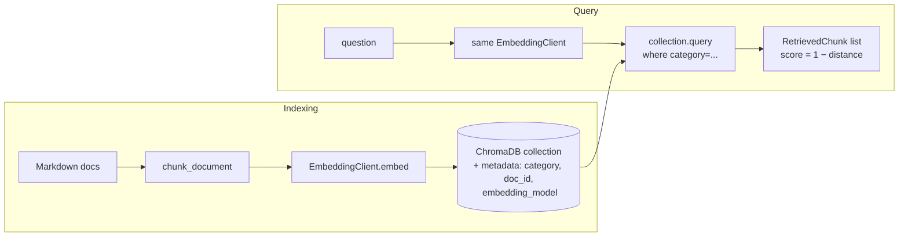

# Module 07 Concepts — Vector Databases and Chunking

In Module 06 you built semantic search the honest way: embed every chunk, keep the vectors in a Python list, compare the query against all of them with cosine similarity. It worked — and it also quietly demonstrated why nobody ships that. This module replaces the list with a real vector database and turns the fuzziest question in retrieval ("how big should chunks be?") into a measured experiment.

## 1. Why embeddings need a storage and retrieval system

Module 06's in-memory list has four fatal properties:

1. **No persistence.** The vectors live in a Python variable. Process exits, index gone. Every run re-embeds the whole corpus — tolerable for 13 documents, absurd for 13,000.
2. **It doesn't scale.** A list comparison is a linear scan: score the query against *every* stored vector, every time. 1M chunks × 384 floats is ~1.5 GB touched per query.
3. **No metadata queries.** "Only search `product_support` docs" means writing your own filter loop next to your own scoring loop.
4. **No lifecycle.** Update one document and your options are: rebuild everything, or hand-roll bookkeeping for which list positions belong to which document.

A **vector store** is the piece of infrastructure that owns these problems: it persists vectors to disk, indexes them for fast approximate nearest-neighbor (ANN) search, stores metadata alongside each vector and filters on it, and gives collections a lifecycle (create, upsert, delete, rebuild).

The trade you are making: a linear scan is *exact* — the true top-k, every time. ANN indexes (Chroma uses HNSW, a graph-based method) are *approximate* — dramatically faster, with a small chance of missing a true neighbor. At course scale you will never notice the difference; at production scale you tune it deliberately.

## 2. ChromaDB, and how our `VectorStore` wraps it

ChromaDB is a local-first, open-source vector database — no server to run, no account to create. The pieces you touch:

- **`chromadb.PersistentClient(path=...)`** — a client backed by a directory on disk. Everything written through it survives process restarts. (The alternative, `chromadb.Client()`, is in-memory only — Module 06 with extra steps.)
- **Collections** — named sets of vectors, like tables in a relational database. Ours is `techcorp_docs` (see `DEFAULT_COLLECTION` in `src/techcorp_agent/vectorstore/chroma_store.py`). Lab A creates throwaway collections next to it; they coexist in the same persist directory without touching each other.
- **Records** — each entry is `(id, embedding, document text, metadata dict)`. We upsert by chunk id (`hr-vacation#2`), so re-adding the same chunk overwrites instead of duplicating.
- **`where` filters** — metadata predicates evaluated *during* the vector search, e.g. `where={"category": "product_support"}`.

### Cosine *distance* vs our similarity convention

This one causes real bugs, so slow down. We configure the collection with `metadata={"hnsw:space": "cosine"}`, and Chroma returns cosine **distance**:

```text
distance = 1 − cosine_similarity      0.0 = identical direction, 2.0 = opposite
```

Lower distance = closer. But the whole course (Module 06, `min_score` thresholds, the RAG modules ahead) uses the convention **higher = closer**. So `VectorStore.query()` converts every result once, at the boundary:

```python
score = 1.0 - float(distance)  # back to cosine similarity: 1.0 identical, ~0 unrelated
```

Read that line in `chroma_store.py` and commit the rule to memory: *know which direction your scores point before you compare them to a threshold.* A `min_score=0.3` filter applied to raw distances would keep the **worst** results and discard the best — and nothing would crash to tell you.

### The embedding-model compatibility guard

Vectors are only comparable to vectors from the **same model**. A query embedded with `all-MiniLM-L6-v2` scored against chunks embedded with the hash client produces numbers that look like similarities and mean nothing — retrieval degrades to noise with no exception raised. This is the classic *silent* retrieval failure.

Our `VectorStore` refuses to let it happen: when a collection is created, it records `embedding_model` in the collection metadata; when any `VectorStore` later opens that collection with a *different* client, `__init__` raises `ValueError` telling you to rebuild the index or switch back. Corrupting the index quietly is not on the menu — you get told at construction time, not three modules later when answers get weirdly bad.



## 3. Document chunking

Whole documents make bad retrieval units. Embed a 5-page policy into one vector and every topic in it gets averaged together — the vector is a blurry summary that matches nothing sharply. Chunking splits documents into pieces that each say roughly one thing, so a question can land on the piece that answers it. Three knobs control the split (all in `src/techcorp_agent/documents/chunking.py`):

- **Chunk size** — the maximum length of a piece (we measure in characters; token-based sizing is the same idea). Small chunks are semantically *sharp* (one fact per vector) but carry little context; the answer's setup — "the following applies to international remote work" — may be in the previous chunk. Large chunks carry full context but *dilute*: many topics per vector, weaker match on any single question, and more prompt tokens spent per retrieved chunk in Module 08.
- **Chunk overlap** — how many characters each chunk repeats from the end of the previous one. Overlap insures against the splitter cutting a sentence or a fact in half: whatever straddled the boundary appears whole in one of the two chunks. The price is duplicated content — the same sentences stored (and potentially retrieved) twice. Lab A measures this directly as the *duplicate-content rate*.
- **Separators** — *where* the splitter is allowed to cut. Our `chunk_text` prefers word boundaries (it looks for the last space in the window instead of cutting mid-word). Our `split_paragraphs` treats blank lines as separators and keeps paragraphs whole, packing consecutive ones up to a limit — structure-aware splitting. Recursive splitters in frameworks generalize this: try `\n\n`, then `\n`, then `" "`, then give up and cut.

Two strategies ship with the course: `fixed` (`chunk_text`: window + overlap, word-boundary aware) and `paragraph` (`split_paragraphs`: respect document structure, no overlap needed because paragraphs are natural units).

### There is no universal best chunk size

If you remember one thing from this module: **no chunk size is best in general.** The right size depends on the corpus (are documents structured in tidy paragraphs? do facts span sections?), the questions (single-fact lookups favor small chunks; "compare X and Y" favors large), the embedding model (each has a token limit and a sweet spot), and what happens downstream (a RAG prompt paying per token feels large chunks in the bill). Anyone who tells you "512 tokens with 50 overlap" without asking about your data is reciting a default, not giving an answer. The only defensible method is the one Lab A runs: fix an evaluation set, vary the configuration, measure. When the corpus or the questions change, measure again.

## 4. Metadata filtering

Every chunk we store carries `doc_id`, `doc_title`, `category`, and `index`. Filtering on metadata combines *hard* constraints with *soft* semantic ranking: `store.query("refund timeline", category="product_support")` means "among product-support chunks only, rank by similarity." That is different from hoping the similarity score alone keeps HR's expense policy out of a customer-refund answer — a filter is a guarantee; a score is a tendency. In Module 11 tools will pick these filters based on the user's question.

## 5. Persistence and re-indexing

Persistence you get for free with `PersistentClient`: index once, query from any later process. Lab B step 7 proves it the only convincing way — a *separate process* reopens the store and the count is still there.

Re-indexing is the part people forget to plan. You must rebuild the collection when any of these change:

1. **The documents** (edited, added, removed) — upsert-by-id handles edits, but stale chunks from deleted or shortened docs linger until a rebuild;
2. **The chunking configuration** — old and new chunk boundaries would otherwise coexist under different ids, double-counting the same text;
3. **The embedding model** — mandatory, and the guard enforces it.

The safe rebuild is `VectorStore.reset()`: it deletes and recreates *this collection only* — never the whole persist directory, which may hold other collections (Lab A's throwaways, other experiments). That is also exactly what `scripts/build_index.py` does before indexing. Rule of thumb: treat the index as a *derived artifact*, like a compiled binary. The Markdown corpus is the source of truth; the collection must always be reproducible from it with one command.

## Common misconceptions

- **"Higher Chroma score = better match."** Chroma returns cosine *distance* — lower is better. Our wrapper converts to similarity (`1 − distance`) so higher is better *inside this course*. Check which convention you are holding before every threshold comparison.
- **"There's a best chunk size; just tell me the number."** See above. The number that wins on TechCorp's corpus at top-4 can lose on your next corpus. Measure.
- **"More overlap is always safer."** Overlap past what's needed to heal boundary cuts just stores the same sentences repeatedly — inflating the index and letting near-duplicate chunks crowd distinct evidence out of top-k. Lab A's duplicate-content rate makes the cost visible (and shows a subtlety: overlap smaller than the measuring window barely registers, while 100-character overlap on 800-character chunks duplicates ~12% of shingles).
- **"I can swap embedding models and keep the index."** Never. Different models, different vector spaces, meaningless scores — and *no error* unless something like our guard checks for it. Rebuild.
- **"The vector DB understands my documents."** It stores vectors and finds nearby ones. All the "understanding" happened in the embedding model, and all the retrievability was decided by your chunking. Garbage chunks in, garbage neighbors out.
- **"Persistent means backed up."** It means *on disk in `.chroma/`*. Delete the directory and the index is gone — which is fine, because a properly-run project can rebuild it from source documents with one command.

## Trade-offs to internalize

- **Chunk size vs retrieval precision.** Small chunks: precise matches, weak context, more chunks to store and retrieve. Large chunks: full context, diluted vectors, fatter prompts downstream. There is a corpus-dependent sweet spot; Lab A finds TechCorp's.
- **Chunk overlap vs duplicated content.** Overlap buys insurance against boundary cuts and pays in duplicate storage and near-duplicate retrievals. Buy only as much insurance as boundary-loss actually costs — which paragraph-aware splitting reduces to almost nothing by not cutting mid-thought in the first place.
- **Exact scan vs ANN index.** The list from Module 06 is exact and O(n) per query; HNSW is approximate and fast. Small corpus: exactness is free, take it. Large corpus: you'll trade a sliver of recall for orders of magnitude in speed, and tune the index to control how big a sliver.
- **One big collection vs many.** One collection + metadata filters is simple and lets one query span everything. Separate collections isolate lifecycles (rebuild experiments without touching production) — which is why Lab A uses throwaway collections next to `techcorp_docs` instead of inside it.
- **Structure-aware vs fixed splitting.** Paragraph splitting respects the author's own topic boundaries and needs no overlap, but depends on well-formed documents; fixed windows work on any text (logs, transcripts, minified anything) but cut blindly. Our corpus is tidy Markdown — Lab A shows what that buys.

Next: [lab.md](lab.md) — run the experiment.
