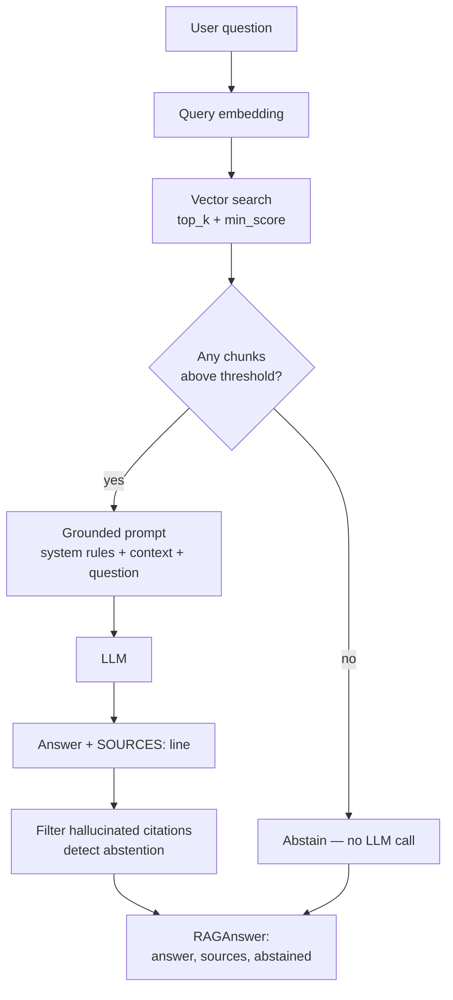

# Module 08 Concepts — Retrieval-Augmented Generation

In Module 07 you learned to *find* the right chunks: give a `VectorStore` a question, get back the most similar pieces of TechCorp's documents. That answers "which documents are relevant?" — not "what should I tell the employee who asked?" This module closes that gap. RAG (Retrieval-Augmented Generation) takes retrieved evidence and hands it to an LLM under a strict contract: answer *only* from this evidence, cite it, and say so when it isn't enough.

Nothing here retrains or fine-tunes a model. RAG changes what the model *sees at runtime*, not what the model *is*.

## 1. The three stages

RAG is three steps in a row. Each is a thing you already have or can build:

1. **Retrieval** — embed the user's question and search the vector store for the most similar chunks. This is Module 06/07 verbatim. In the pipeline it is `RAGPipeline.retrieve`, a thin call to `store.query(question, top_k=..., min_score=...)`. The threshold is doing real work here: chunks that only weakly match are dropped, so weak coincidental overlap never becomes "evidence".

2. **Augmentation** — take those chunks and build a prompt around them. The retrieved text becomes *context* the model can read, wrapped in instructions that tell it how to use that context. In the pipeline this is `build_context_block` (rendering each chunk with its source id) plus `build_messages` (the system rules + the context + the question). "Augmented" is the key word: the model's own prompt is augmented with fresh, question-specific evidence it did not have a moment ago.

3. **Generation** — call the LLM on that augmented prompt and turn its reply into a structured answer. The model writes prose *and* a `SOURCES:` line; `parse_answer` splits the two apart, and `answer` filters the citations and detects abstention. The output is a `RAGAnswer(answer, sources, abstained)` — not a raw string.

## 2. The pipeline, end to end



Read left of the diamond as Module 07 and right of it as this module. The diamond itself — "nothing relevant retrieved, so abstain before spending a model call" — is the single most important design decision in the pipeline.

## 3. RAG supplies evidence at runtime; it does not modify the model

A common mental model is "RAG teaches the model our documents." It does not. The model's weights are frozen. What RAG does is *put the relevant document text into the prompt for this one question*, so the model can read it and answer from it, then forget it entirely on the next call.

The consequences are worth internalizing:

- **You can change the knowledge without touching the model.** Update a policy document, re-index, and the next answer reflects the change immediately — no retraining, no deploy of a new model.
- **The model only knows what you retrieved.** If retrieval misses the right chunk, the model cannot answer correctly no matter how capable it is. Retrieval quality caps answer quality.
- **It is stateless per question.** Each `answer()` call retrieves fresh and builds a fresh prompt. There is no accumulating memory of past documents in the model.

Contrast this with fine-tuning, which *does* modify the model but bakes knowledge in at training time, can't be updated cheaply, and gives you no natural way to cite where an answer came from. RAG trades a bigger prompt (and its token cost) for freshness, updatability, and attribution.

## 4. Returning documents vs generating an answer

These are two different products, and it matters which one you're shipping.

- **Returning documents** is what a search engine does: here are the five most relevant chunks, you read them. That is exactly what `retrieve()` gives you — a `list[RetrievedChunk]`. Useful, but it puts the reading and synthesis on the human.
- **Generating an answer from documents** is what the full pipeline does: it reads the chunks *for* the user and writes a direct, grounded answer with citations. That is `answer()`.

The generation step is where the value and the risk both live. The value: a synthesized answer that may span several chunks (scenario 6 below). The risk: an LLM asked to write prose will happily write *confident* prose whether or not the evidence supports it. The entire grounding contract exists to keep generation honest.

## 5. The grounding contract

The contract is the `SYSTEM_PROMPT` in `src/techcorp_agent/rag/pipeline.py`. Its five rules, quoted verbatim:

```text
Rules you must follow:
1. Answer company-specific questions ONLY from the context documents supplied below.
2. If the context does not contain the answer, reply exactly:
   "I do not have enough information in the provided TechCorp documents to answer that question."
3. Never invent policy details, numbers, or exceptions.
4. Keep the answer separate from the references.
5. End your reply with a final line of the form:
   SOURCES: <comma-separated source ids you actually used>
   or "SOURCES: none" when abstaining.
```

Each rule maps to a concrete pipeline behavior:

- **Rule 1** is what makes retrieval quality *matter*: the model is forbidden from using its own background knowledge for company-specific claims.
- **Rule 2** pins the abstention wording exactly. That exact string is `ABSTENTION_TEXT` in the code, and the pipeline detects abstention by looking for it (case-insensitively) in the answer. This is why the starter *imports* `ABSTENTION_TEXT` rather than retyping it — one stray character and the detection breaks.
- **Rule 3** is the anti-hallucination rule: no invented numbers, no invented exceptions.
- **Rule 4** is why the answer and the `SOURCES:` line are separable at all — `parse_answer` splits the reply on the `SOURCES:` line and returns the prose before it.
- **Rule 5** defines the `SOURCES:` line protocol: a final line, comma-separated ids, or `SOURCES: none`. This is the machine-readable citation channel.

The context itself is rendered by `build_context_block` so the model can see *which* source each fact came from:

```text
[source: hr-dress-code] Dress Code Policy
Business casual is the default dress code. Jeans are allowed at headquarters.
```

## 6. Abstention is a feature, not a failure

The instinct is to treat "I don't know" as the pipeline failing. It is the opposite. For an internal policy assistant, a confidently wrong answer about vacation days or refund eligibility is far more damaging than an honest "not in the documents." Abstention is the pipeline's most valuable safety property.

The pipeline abstains in two distinct places:

1. **Before the LLM, when retrieval is empty.** If `retrieve()` returns nothing above `min_score`, `answer()` returns `RAGAnswer(answer=ABSTENTION_TEXT, sources=[], abstained=True)` *without calling the model at all*. There is no evidence to ground an answer, so calling the model could only produce ungrounded guesses — and it would cost a request. Cheaper and safer to abstain immediately.

2. **After the LLM, when the model itself abstains.** Even with chunks retrieved, the model may judge the evidence insufficient and reply with the abstention text (Rule 2). `answer()` detects this by checking whether `ABSTENTION_TEXT` appears in the reply and, if so, forces `sources = []` — an abstention must never credit sources.

Both paths converge on the same `RAGAnswer`, and the `abstained` flag lets callers (and Module 09's evaluation) tell a real answer from a refusal.

## 7. Filtering hallucinated citations

Rule 5 asks the model to list the source ids it used. But the model can list *anything* — including a plausible-sounding id it invented (`fashion-blog-2026`, `wikipedia-dress-codes`) or a document it was never shown. Trusting that list blindly would let a hallucinated citation slip through as if it were real provenance.

So the pipeline never trusts the model's citation list on its own. It intersects the model's claimed sources with the ids it *actually supplied*:

```python
supplied_ids = {retrieved.chunk.doc_id for retrieved in chunks}
sources = [s for s in sources if s in supplied_ids]
```

A source id survives only if the pipeline handed that document to the model in this very prompt. Anything else — a fabricated id, or a real id the model didn't receive — is dropped. This is the difference between "the model *said* it used this source" and "the model *was actually given* this source." Only the latter is trustworthy provenance.

## 8. How this connects to Modules 05–07

RAG is the payoff that makes the earlier modules matter:

- **Module 05 (documents & chunking)** produced the `Chunk`s. Chunking decisions you made there — how big, where to split — directly shape what a single retrieved chunk can support.
- **Module 06 (semantic search)** produced the notion of similarity that ranks chunks against a question. RAG's retrieval stage *is* semantic search.
- **Module 07 (vector databases)** produced the `VectorStore` with its `top_k`/`min_score` query interface. RAG's `retrieve()` is one line on top of it.

RAG doesn't replace any of these — it composes them and adds the generation contract on top. And Module 09 will show that RAG can still fail (wrong chunk indexed, poorly calibrated threshold, model ignores context), which is why evaluation and grounding checks come next.

## Common misconceptions

- **"RAG makes the model always right."** No. RAG makes the model *grounded in what you retrieved*. If retrieval misses the answer, or the chunks are wrong, or the threshold is miscalibrated, the answer is wrong or absent — the model can only be as right as its evidence. RAG shrinks hallucination; it does not eliminate error.
- **"More chunks always help."** No. Adding chunks past what's needed dilutes the prompt with irrelevant text (which can *distract* the model), raises token cost, and — when several retrieved chunks conflict — can make the answer worse, not better. `top_k` is a budget, not a target to maximize.
- **"RAG teaches the model our documents."** It supplies documents at runtime for one question. The model's weights never change; nothing is learned.
- **"If the model cites a source, the answer is trustworthy."** Only if that source was actually supplied. A cited-but-not-supplied id is a hallucination, which is exactly why the pipeline filters citations against the supplied set.

## Trade-offs to internalize

- **Grounding vs retrieval failure.** Rule 1 forbids the model from using its own knowledge — which is precisely what makes answers trustworthy *and* what makes a retrieval miss fatal. A less strict prompt would let the model "fill in" from memory (sometimes right, sometimes a confident fabrication). TechCorp chooses strict grounding and accepts that a missed retrieval becomes an abstention rather than a lucky guess.
- **Threshold vs abstention rate.** `min_score` is the dial between two failure modes. Raise it and you abstain more (fewer answers, but the ones you give rest on strong evidence — you also risk refusing questions you *could* have answered). Lower it and you answer more (but weak, coincidental matches start counting as evidence and grounding erodes). Scenario 5 and the lab's stretch exercise make this dial visible: at `min_score=0.30` the iguana question retrieves nothing and abstains; drop it and coincidental overlap sneaks chunks in.

Next: [lab.md](lab.md) — build it.
