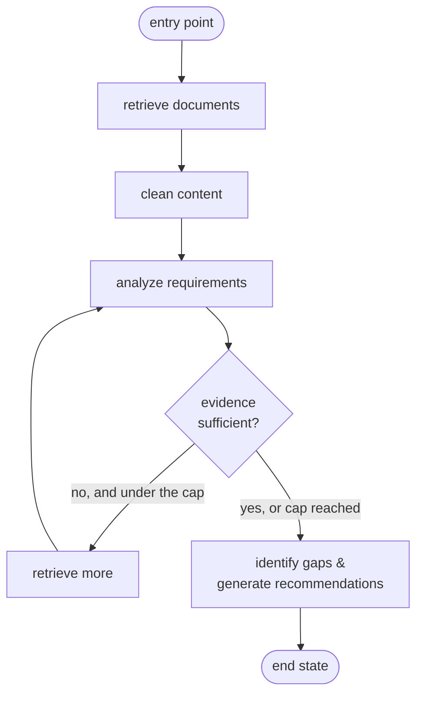

# Module 10 Concepts — Workflows as Graphs with LangGraph

Until now, every TechCorp script has been a straight line: call the LLM, parse the reply, done (Module 02), or retrieve → augment → generate (Module 08). That works right up to the moment the flow needs to **branch** ("is this a simple question or a policy analysis?") or **repeat** ("the evidence was too thin — go get more"). Expressed as nested `if`/`while` in one big function, that logic quickly becomes tangled and hard to test.

LangGraph gives you a different shape: model the workflow as a **graph** of small, named steps that share one state object. This module teaches that shape on the workflow TechCorp actually needs — a **GDPR policy review**.

## The running example: TechCorp's GDPR policy review

Legal has asked whether TechCorp's data-retention policy meets GDPR. The workflow is:

1. **Retrieve documents** — pull the relevant policy text.
2. **Clean content** — strip boilerplate and formatting noise.
3. **Analyze requirements** — extract what GDPR demands.
4. **Identify gaps** — compare the policy against those demands.
5. **Generate recommendations** — say what to change.
6. **Retry retrieval when evidence is insufficient** — if step 3 finds too little to judge, loop back and retrieve more, up to a limit.

That last step is the interesting one: it is a **loop with an exit condition**, and it is exactly where a naive `while` loop can run forever. Hold this workflow in mind; every term below maps onto it.



The labs build this shape up piece by piece: Lab A is the bare `START → node → node → END` skeleton, Lab C is the diamond (the `{evidence sufficient?}` branch), and Lab D is the loop back to `analyze`.

## 1. Graph, node, edge

A **graph** is the whole workflow: a set of steps and the connections between them. In LangGraph you build one with `StateGraph(...)`, add its pieces, then `compile()` it into something you can run.

A **node** is one step — a plain Python function. It receives the current shared state and returns a dictionary of the fields it changed. In our example, "retrieve documents" and "clean content" are each a node.

```python
def clean_content_node(state: ReviewState) -> dict:
    cleaned = strip_boilerplate(state["raw_text"])
    return {"clean_text": cleaned}  # only the field it changed
```

An **edge** connects two nodes: "after this node, run that one." `add_edge("retrieve", "clean")` means clean always follows retrieve. Edges are the arrows in the diagram.

## 2. Entry point and end state

A graph needs to know where to start and where it is allowed to stop.

- The **entry point** is the first node to run. You mark it with an edge from the special `START` sentinel: `add_edge(START, "retrieve")`.
- An **end state** is reached when a node connects to the special `END` sentinel: `add_edge("generate", END)`. Running halts and the final state is returned.

`START` and `END` are imported from `langgraph.graph`. (Under the hood they are the strings `"__start__"` and `"__end__"` — you never need to type those.)

## 3. Shared state and partial state updates

Every node reads from and writes to one **shared state**: a single object threaded through the whole run. We declare its shape with a `TypedDict`, so every field and its type is explicit:

```python
from typing import TypedDict


class ReviewState(TypedDict):
    question: str
    clean_text: str
    evidence_score: float
    iteration: int
    status: str
```

Crucially, a node returns a **partial state update** — a dict of *only the keys it touched*, not the whole state. LangGraph merges that partial dict into the running state for you. `clean_content_node` above returns just `{"clean_text": ...}`; the `question` and `iteration` fields are left exactly as they were. This is what keeps nodes small and independent: each one minds its own fields.

### Reducers: when "merge" should mean "append"

By default, merging a key **overwrites** the old value. Sometimes you want to **accumulate** instead — for example, a running trace log that every node adds a line to. You get that by annotating the field with a **reducer**:

```python
import operator
from typing import Annotated


class ReviewState(TypedDict):
    trace: Annotated[list[str], operator.add]  # returned lists are concatenated, not replaced
```

Now when two nodes each `return {"trace": ["..."]}`, LangGraph runs `operator.add` on the lists and *appends* instead of clobbering. Every lab in this module uses exactly this pattern for its observability trace.

## 4. Conditional edges — branching

A plain edge always goes to the same next node. A **conditional edge** picks the next node by calling a small routing function that returns a *label*, then looking that label up in a map:

```python
def route_evidence(state: ReviewState) -> str:
    return "stop" if state["evidence_score"] >= 0.75 else "retry"


graph.add_conditional_edges(
    "analyze",  # after this node...
    route_evidence,  # ...call this to get a label...
    {"retry": "retrieve_more", "stop": "generate"},  # ...and map it to a node.
)
```

This is the `{evidence sufficient?}` diamond in the diagram. The routing function returns a *label* (`"stop"` / `"retry"`), not a node name; the map decides where each label leads. That indirection keeps the decision readable and the wiring in one place. Lab C is a pure conditional route with no loop.

## 5. Loops — and why they need a cap

An edge can point *backward*. `add_edge("retrieve_more", "analyze")` sends control from the loop body back to the analysis node — that is a **loop**. Combined with the conditional edge above, the graph repeats `analyze → retrieve_more → analyze → …` until `route_evidence` returns `"stop"`.

The danger is obvious: if the evidence never improves, `route_evidence` never returns `"stop"`, and the graph loops forever. So the guard must have a **second, unconditional stop condition** — an iteration cap:

```python
def route_evidence(state: ReviewState) -> str:
    if state["evidence_score"] >= state["threshold"]:
        return "stop"
    if state["iteration"] >= state["max_iterations"]:  # the safety cap
        return "stop"
    return "retry"
```

The cap is checked no matter what the evidence looks like, so the loop is **provably finite**. This is a hard requirement of the spec, and Lab D's test asserts the loop stops at exactly the cap. (LangGraph also has a global `recursion_limit` that raises `GraphRecursionError` as a last-resort backstop — but that is a crash, not a graceful stop. Your own cap should end the loop *cleanly*, before the backstop ever fires.)

## 6. Persistence (a preview)

Everything above runs in memory: `invoke()` starts with a fresh state and returns the final one. Real assistants need to **remember across turns and restarts** — pause a workflow, come back tomorrow, and continue. LangGraph does this with **checkpointers**: pass one to `compile(checkpointer=...)` and the graph saves its state after each step under a thread id, so a later `invoke()` resumes where it left off.

You do **not** need checkpointers in this module — just know the seam exists. The deep dive (SQLite-backed persistence, thread ids, resuming conversations) is **Module 15**.

## 7. Deterministic workflow vs agentic decision

This is the mental model to leave the module with. There are two ways to decide "what runs next":

- **Deterministic workflow (this module).** *You* draw the edges. The graph's control flow is fixed and visible — you can point at the diagram and know every path it can take. The LLM lives *inside* nodes (writing a draft, analyzing evidence), but it does **not** choose the route; your `route_*` functions do, from state fields. Predictable, testable, auditable.
- **Agentic decision (Module 11 onward).** The **model** chooses what to do next — which tool to call, whether to loop again — from a menu you give it. Flexible and powerful, but the control flow is decided at runtime by the model, so it is harder to predict and test.

TechCorp's GDPR review is a deterministic workflow on purpose: for a compliance process, "here is exactly the path it took, and here is why" is worth more than cleverness.

## Common misconceptions

- **"LangGraph makes the model smarter."** No. LangGraph is plumbing — it orchestrates *when* your nodes run and *how* state flows between them. The model in a node is exactly as capable (and as fallible) as it was in Module 02. A better graph gives the model better *structure and retries*; it does not raise the model's ceiling.
- **"Loops can run forever safely — I'll just let it converge."** A loop with only a quality-based exit (`until the evidence is good enough`) will spin forever the moment quality *stalls*, burning tokens and wall-clock time. Every loop needs an unconditional cap (max iterations) that fires regardless of quality. Convergence is a hope; the cap is a guarantee.
- **"A node must return the whole state."** It returns only the keys it changed; LangGraph merges the partial update. Returning the whole state is not just verbose — it silently overwrites fields other nodes set.
- **"The conditional edge runs the branches; I just pick one."** The routing function only *chooses a label*. It must not do the work of the branch — keep it a pure, cheap decision so it is easy to read and test.

## Trade-offs to internalize

- **Explicit graph vs one big function.** For three straight-line steps, a graph is more ceremony than a plain function — honest overhead. The graph earns its keep the moment you need branching, loops, retries, observability per step, or (later) persistence. Reach for it when the control flow is the hard part, not the arithmetic.
- **Explicit graph vs flexible agent loop.** A hand-drawn graph is predictable and auditable but rigid: a path you didn't draw can't happen, which is a feature for compliance and a limitation for open-ended tasks. An agent loop (Module 11+) adapts to inputs you didn't foresee but can take surprising, hard-to-test paths. Choose by how much you value predictability over flexibility for *this* workflow.
- **Iteration cap: too low vs too high.** A cap of 1 means no real retries — thin evidence just gives up. A cap of 20 risks long, expensive runs when retrieval is genuinely stuck. Pick a small number (this module uses 3), record the iteration count in the trace, and treat "hit the cap" as a signal worth logging, not a silent default.
- **Trace verbosity vs noise.** Recording every node entry and route makes runs debuggable and is the seed of real observability (Module 19) — but a trace that logs *everything* is as useless as one that logs nothing. Trace the decisions: node entered, fields changed, route taken, iteration number, final status. That is exactly what the labs record.

Next: [lab.md](lab.md) — build all four graphs.
