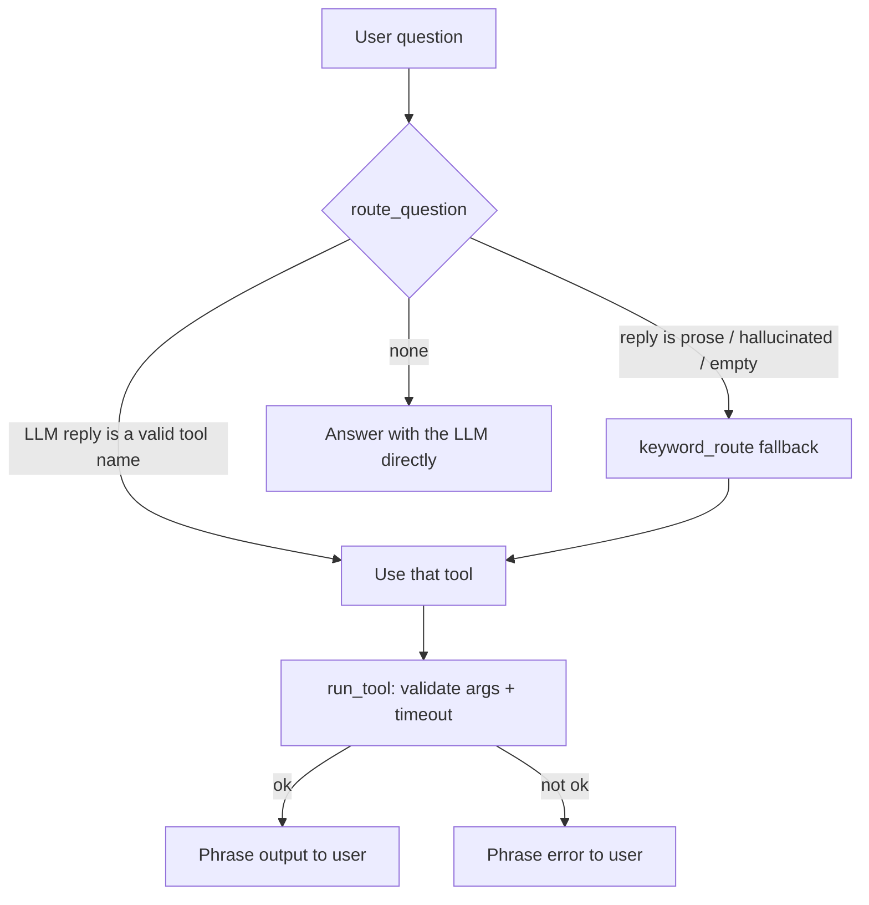

# Module 11 Concepts — Tools and Intelligent Routing

Through Module 10 the agent could reason and retrieve, but everything it "knew" came from either the model's weights or the document index. Ask it "what is 17.5% of 8400?" and it will *guess* — confidently, and sometimes wrong. Ask it "where is order TC-1234?" and it has no way to know. A **tool** closes that gap: it is a named, typed capability the agent can call to get an authoritative answer from code or data instead of from the model's imagination.

This module builds three tools and the **router** that decides which one to use.

## 1. What a tool actually is

A tool is four things bundled together:

| Part | What it is | Why it matters |
|---|---|---|
| **name** | A short stable identifier (`calculator`, `order_lookup`). | The router's answer *is* this string; the agent looks the tool up by it. |
| **description** | One or two sentences: what the tool does and *when to pick it*. | This is what the LLM reads to route. It carries more weight than the code (see §4). |
| **input schema** | A Pydantic model of the arguments (`expression: str`, `order_id: str`). | Lets you *validate* arguments before running — a missing field becomes a clean error, not a `TypeError` three frames deep. |
| **output** | A normalized `ToolResult` (`ok`, `output`, `error`). | The agent branches on one boolean; a failed tool is data, not an exception. |

In this course that bundle is `techcorp_agent.tools.base.ToolSpec`, and every tool returns `ToolResult`. Read both — they are tiny.

```python
ToolSpec(
    name="calculator",
    description="Evaluate an arithmetic expression and return the number. Use for any math...",
    args_schema=CalculatorArgs,  # a pydantic BaseModel: expression: str
    func=_run,  # (CalculatorArgs) -> ToolResult
)
```

## 2. Input schema and output schema

The **input schema** is the contract for calling the tool. `ToolSpec.run(raw_args)` validates the raw dict against `args_schema` first; if a required field is missing or mistyped, you get back a `ToolResult(ok=False, error="...missing required argument...")` — never a crash. This is the same defensive instinct as Module 02's "the response is an object, guard every hop," applied to the tool's *inputs*.

The **output schema** is `ToolResult`. Every tool — success, no-data, or error — returns one:

```text
ToolResult
├── tool_name   which tool produced this
├── ok          the ONLY field the agent branches on
├── output      user-facing text (empty on failure)
└── error       short actionable message (None on success)
```

Because failure is a value, the agent's loop has no `try/except` around tool bodies. "No such order TC-9999" is `ok=False` with a helpful message, exactly like a real API returning 404 — not an exception that unwinds the whole request.

## 3. Tool selection (routing)

Routing is the decision: *given this question, which tool — if any — should run?* Two strategies, and this module uses both together:

- **LLM routing** — put the tool catalog in a prompt and ask the model to reply with exactly one tool name or `none`. Strength: it reads intent ("where's my package?" → `order_lookup`) that no keyword list fully captures. Weakness: it can drift — reply with prose, invent a tool that does not exist, or pick the wrong one.
- **Deterministic (keyword) routing** — decide from surface patterns: an order id `TC-\d+` → `order_lookup`; a math operator or "multiplied by" → `calculator`; policy words → `document_search`. Strength: cheap, testable, always available, never hallucinates. Weakness: blind to intent — it cannot tell "explain what a warranty is" (general) from "what does TechCorp's warranty cover" (policy).

`route_question(question, llm, tools)` asks the LLM, then **falls back to `keyword_route` whenever the reply is not a valid tool name.** The deterministic router is the safety net under the smart-but-fallible one.



## 4. Why the description matters more than the code

This is the single most important idea in the module. The router never sees a tool's body — it sees only its **name and description**. Two tools with identical code but one described as "does math" and the other as "Evaluate an arithmetic expression; use for sums, products, percentages; do NOT use for looking up facts or orders" will route very differently. Vague descriptions are the number-one cause of wrong-tool selection.

Good tool descriptions state **what** the tool does *and* **when to choose it over its neighbors** — often including an explicit "do NOT use for…". Notice each tool in `src/techcorp_agent/tools/` ends its description by ruling out its siblings. That negative space is what makes the tools *distinguishable*.

## 5. Error handling — the four failure modes, one shape

`run_tool(tool, raw_args, timeout_seconds=...)` funnels every way a tool can fail into a single `ToolResult(ok=False)`:

| Failure | Cause | How it is handled |
|---|---|---|
| Missing/invalid argument | Router picked `order_lookup` but no id was extracted | `ToolSpec.run` validation → failure result naming the field |
| Tool returns no data | Empty index, unknown order | The tool itself returns `ok=False` with a helpful message |
| Tool raises | A bug or unexpected input inside the tool | Caught in `run_tool`, returned as `"Tool 'x' raised: ..."` |
| Tool times out | Slow/hung tool (a real API stalling) | `ThreadPoolExecutor` + `future.result(timeout=...)` → timeout failure |

The agent phrases each of these to the user as "`[tool] could not help: <reason>`" — an honest, actionable message, never a stack trace.

## 6. Read-only vs write-capable tools, and human approval

**Every tool in this module is read-only.** The calculator computes; `order_lookup` reads mock JSON; `document_search` queries the index. None of them *change* anything — no refund is issued, no order is cancelled, no record is written. That is a deliberate safety default (course rule 8.5): a routing mistake with a read-only tool wastes a call; a routing mistake with a *write* tool ("cancel order TC-1234") is a real incident.

The moment a tool can take a **write action** — refund, cancel, email a customer — you need a **human-approval boundary**: the agent proposes the action, a person confirms, and only then does it execute. Those approval gates (human-in-the-loop) arrive in **Module 16**. Authentication and authorization — *who* is allowed to call a write tool — belong at that same boundary, not inside the tool body. We flag where they go now so that when write tools appear, the seam is already in your mental model.

## Common misconceptions

- **"The model runs the tool."** No. The model only *names* a tool (routing); *your code* validates the arguments and executes it. The model never touches your data or your Python.
- **"If routing is good, error handling is optional."** Backwards. Good routing reduces *wrong* tool calls; it does nothing about a valid call that hits an unknown order, a slow API, or a bad argument. Every tool call needs the failure path.
- **"Better model = better tool descriptions needed less."** A stronger model tolerates vague descriptions slightly better, but the descriptions are still the only thing it routes on. Precise, mutually-exclusive descriptions help every model.
- **"A tool raising is fine, I'll catch it in the agent."** Then every future tool needs the same catch, in every call site. Normalize failure *once*, at the tool boundary, so the agent loop stays clean.
- **"Keyword routing is a toy; real systems just use the LLM."** Production routers keep a deterministic fallback precisely because LLMs occasionally return garbage, and a router that sometimes returns nothing runnable is worse than one that is dumb but reliable.

## Trade-offs to internalize

- **Tool power vs safety.** A read-only tool is safe to route slightly wrong; a write-capable tool is not. Keep tools read-only until a lab (Module 16) explicitly adds approval, and put auth/authz at the write boundary — never inside the tool.
- **LLM routing vs deterministic routing.** LLM routing reads intent but can hallucinate; keyword routing is reliable but intent-blind. Neither is "better" — you run the LLM for its judgment and keep the deterministic router as the floor it can never fall through. This mirrors Module 08's *agent autonomy vs predictability* trade-off, now at the tool layer.
- **Rich tool output vs prompt cost.** A tool that returns 4 full document chunks is more useful and more expensive to feed back to the model than one returning a one-line summary. Return what the next step actually needs.

Next: [lab.md](lab.md) — build it, then break it six ways on purpose.
