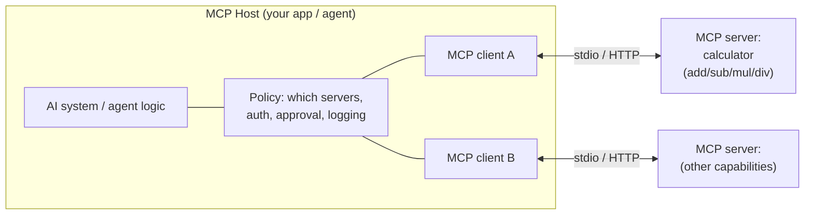
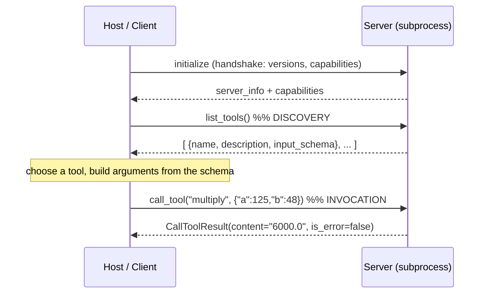

# Module 12 Concepts — The Model Context Protocol

In Module 11 you wrapped Python functions as tools and let one agent process
call them. That works — until a second app wants the same tools, or a tool needs
to live in a different language, process, or machine. Copy-pasting tool code
into every agent doesn't scale, and it smears one team's capabilities across
everyone else's codebase.

The **Model Context Protocol (MCP)** solves this by standardizing the *wire
between an AI system and a set of tools*. Build a capability once as an MCP
**server**; any MCP-speaking **host** can then discover and use it. Nothing here
is magic — it is a subprocess (or an HTTP endpoint), a JSON handshake, and a
list of typed functions. You are going to build both ends and see every message.

## 1. The USB-C analogy — used carefully

MCP is often described as "USB-C for AI tools." The analogy is useful if you map
it precisely and don't over-read it:

| USB-C | MCP | What it is here |
|---|---|---|
| The **connector standard** | The **MCP protocol** | The agreed message format and handshake. Not a program — a *specification*. |
| A **device** (drive, mic, hub) | An **MCP server** | A program that *exposes capabilities* (tools, resources, prompts). |
| A device's **functions** (read a file, capture audio) | **Tools** | The individual callable functions the server advertises. |
| Your **laptop** deciding what to plug in and trust | The **host application** | The program that connects the AI system to servers and stays in charge. |

Where the analogy breaks: plugging in a USB device grants it real power over your
machine. **MCP does not.** A connected server only *offers* capabilities; the
host decides which servers exist, whether to authenticate, and whether any given
tool call is even allowed to run (see §8). Keep that distinction — it is the
difference between a demo and a safe system.

## 2. The four roles: host, client, server, tool

- **MCP host** — the top-level application the user actually runs (an IDE
  assistant, a chat app, TechCorp's agent). It owns configuration: which servers
  to launch, what credentials to hand them, which tool calls to approve, what to
  log. In this module *your terminal running the client script* is the host.
- **MCP client** — the component *inside the host* that manages one connection
  to one server: it runs the handshake, discovers tools, and forwards
  invocations. One host typically runs several clients, one per server.
- **MCP server** — a separate program that exposes capabilities. Yours exposes
  four calculator tools. It knows nothing about who is calling or why.
- **Tool** — one callable function the server advertises, with a name, a
  description, and an input **schema**. `multiply(a: float, b: float)` is a tool.



The host sits between the AI and the servers on purpose: every capability the
model can reach passes through host-controlled policy.

## 3. What a server exposes: tools, resources, prompts

The MCP spec defines three kinds of server capability. Not all are used in every
module, and the installed SDK's support differs:

| Capability | What it is | Installed `mcp` 2.0 support |
|---|---|---|
| **Tools** | Callable *functions* the model can invoke to *do* something (compute, query, act). This module is all tools. | Yes — `@server.tool(...)`. |
| **Resources** | Readable *data* the host can fetch by URI (a file, a record) to put into context. Read-only by nature. | Yes — `@server.resource(...)` / `server.add_resource(...)`. |
| **Prompts** | Reusable, parameterized *prompt templates* the server offers the host. | Yes — `@server.prompt(...)`. |

We build **tools** here because they make discovery *and* invocation *and* error
handling visible in one loop. Resources and prompts appear in later modules.

## 4. Tool schema — the contract the model reads

A tool is not just a function; it is a function **plus a machine-readable
description of its inputs**. When you decorate a typed Python function:

```python
@server.tool(description="Multiply two numbers and return their product (a * b).")
def multiply(a: float, b: float) -> float:
    return a * b
```

the SDK derives a JSON Schema from your type hints and ships it to the client on
discovery. For the calculator that schema looks like:

```json
{
  "type": "object",
  "properties": {
    "a": { "title": "A", "type": "number" },
    "b": { "title": "B", "type": "number" }
  },
  "required": ["a", "b"]
}
```

This is why **types and descriptions are load-bearing**, not decoration: the
host/model chooses tools and fills arguments from the schema and description
alone. In `mcp` 2.0 the schema is on `tool.input_schema` (snake_case; `mcp` 1.x
called it `inputSchema`). If arguments don't match the schema, the call comes
back as a **validation error** (§7) before your function body ever runs.

## 5. Transport — stdio vs HTTP

The protocol is transport-agnostic. Two transports matter:

- **stdio** — the host launches the server as a **child process** and they
  exchange JSON-RPC messages over stdin/stdout. Zero network, great for local
  tools and for tests. **This module uses stdio.**
- **Streamable HTTP** — the server is a long-lived HTTP endpoint the host
  connects to over the network. Right for shared/remote servers, but now you own
  transport security, auth, and networking. (`mcp` 2.0 also still ships an SSE
  transport for backward compatibility.)

Same tools, same schemas, same discovery — only the pipe changes. Start local
(stdio), graduate to HTTP when a server must be shared.

## 6. Discovery and invocation — the two-phase loop

Every MCP session has the same shape:



**Discovery** (`list_tools`) is what makes MCP dynamic: the host doesn't hard-code
the tool list, it *asks*. Add a tool to the server, restart, and it simply
appears — you'll do exactly that in the Lab B stretch. **Invocation**
(`call_tool`) runs one tool with arguments and returns a `CallToolResult` whose
`content` holds the output and whose `is_error` flag says whether it failed.

The `mcp` 2.0 client APIs you'll use (verified against the installed 2.0
package):

```python
from mcp import ClientSession, StdioServerParameters, stdio_client

params = StdioServerParameters(command=sys.executable, args=["server.py"])
async with stdio_client(params) as (read, write):
    async with ClientSession(read, write) as session:
        await session.initialize()
        tools = (await session.list_tools()).tools  # discovery
        result = await session.call_tool("multiply", {"a": 125, "b": 48})  # invocation
        print(result.content[0].text, result.is_error)
```

## 7. Error handling — errors are results, not crashes

A robust server never dies because a caller sent bad input. In `mcp` 2.0, when a
tool raises — divide-by-zero, or a Pydantic **validation error** from a
missing/wrong-typed argument — the runtime catches it and returns a normal
result with `is_error=True` and a human-readable message in `content`. The server
process stays alive and keeps serving.

| Failure | Cause | How it surfaces | Your client checks |
|---|---|---|---|
| **Server / tool error** | tool body raised (e.g. `divide(10, 0)`) | `CallToolResult(is_error=True, content="…divide by zero…")` | `result.is_error` |
| **Validation error** | args don't match `input_schema` (missing/wrong type) | `CallToolResult(is_error=True, content="…validation error…")` | `result.is_error` |
| **Unknown tool** | called a name that isn't advertised | `CallToolResult(is_error=True, content="Unknown tool: …")` | `result.is_error` |

The lesson: **inspect `is_error`**, don't assume a raised exception. A crashed
server is a bug; a returned error is correct behavior.

## 8. Permissions and trust — MCP is not magical autonomy

The most important idea in this module is what MCP does **not** do. Connecting a
server does not hand the AI free rein. The **host** stays in control of:

- **Which servers are available** — nothing runs that the host didn't launch.
- **Authentication** — the host provides credentials to servers that need them;
  the calculator needs none, but a database server would.
- **Permissions & approval** — the host can require human approval before a tool
  runs, and can refuse entirely. A tool being *discoverable* is not permission to
  *invoke* it.
- **Logging** — the host records what was called with what arguments (auditing).
- **Error handling** — the host decides how failures degrade.

Trust is directional and earned: an MCP server is third-party code you are
choosing to run. A calculator is harmless; a server that reads files, sends
email, or hits a payment API is exactly as dangerous as the actions it exposes.
Per TechCorp's safe defaults, treat servers as **read-only unless a lab
explicitly teaches approval**, and never connect a server you don't trust.

## 9. The distinction that defines this module

This is the completion criterion — be able to place each of these precisely:

| Thing | What it is | Where it lives | Who calls it |
|---|---|---|---|
| **A Python function** | `def multiply(a, b): return a*b`. Just code. No schema, no discovery, no boundary. | In a module | Any Python code that imports it |
| **A tool wrapper** (Module 11 `ToolSpec`) | A function + metadata (name, description, arg schema) so *one agent process* can pick and call it. Still in-process. | Inside one agent app | That agent's routing logic |
| **An MCP server** | A separate program that *advertises* tools over a protocol so *any* host can discover and call them across a process/network boundary. | Its own process | Any MCP client |
| **An MCP client** | The connector inside a host that runs the handshake, discovers a server's tools, and forwards invocations. Speaks the protocol; contains no business logic. | Inside the host | The host / agent |
| **An AI agent using an MCP tool** | The agent (LLM + control loop) that *decides* which discovered tool to call, fills arguments from the schema, calls it via the client, and uses the result — under host policy. | The host | The user's request drives it |

Read top to bottom: a bare function becomes reachable-in-process as a *tool
wrapper*, becomes reachable-across-a-boundary as an *MCP server*, is *reached*
through an *MCP client*, and is *chosen and used* by an *agent*.

## Common misconceptions

- **"MCP lets the AI do anything it wants."** No — the host controls which
  servers exist, auth, approval, logging, and error handling. Discoverable ≠
  permitted (§8).
- **"An MCP server *is* the AI."** No. The server is dumb tool code; it has no
  model and makes no decisions. The agent lives in the host.
- **"The tool description is just a comment."** It is part of the contract the
  model reads to choose and call the tool. Vague descriptions cause wrong calls
  (§4).
- **"A bad argument crashes the server."** Not if the runtime is doing its job:
  it returns `is_error=True`. Check the flag (§7).
- **"MCP requires a network."** No — stdio launches the server as a local
  subprocess; this whole module runs offline (§5).
- **"`FastMCP` is the class to import."** In the installed `mcp` **2.0** it's
  `mcp.server.MCPServer`; `mcp.server.fastmcp` was removed. Same decorator
  ergonomics.

## Trade-offs to internalize

- **MCP reusability vs permission & security requirements.** Standardizing tools
  behind a protocol makes them reusable across every host — a real multiplier.
  But each connected server is code you must *trust*, authenticate, permission,
  approve, and log. The reuse is free; the governance is not. Weigh the win
  against the surface area before you connect a server, especially one that isn't
  read-only.
- **stdio vs HTTP transport.** stdio is trivially secure (a child process, no
  network) but local-only and one-host-per-process. HTTP makes a server shared
  and remote but hands you auth, transport security, and availability to own.
  Start on stdio; move to HTTP only when sharing demands it.
- **In-process tool wrapper vs out-of-process MCP server.** A `ToolSpec` is
  simpler and faster — no serialization, no subprocess — but locks the tool to
  one app and one language. An MCP server costs a boundary (spawn, JSON-RPC,
  latency) and buys reuse, isolation, and language independence. Not every tool
  deserves to be a server.

Next: [lab.md](lab.md) — build both ends.
