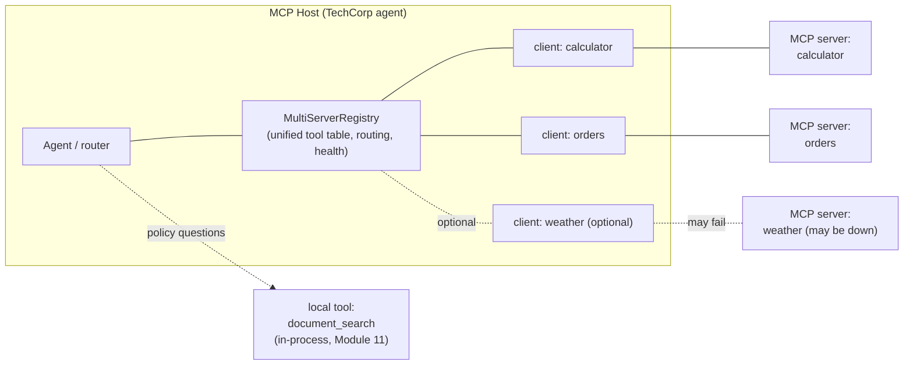
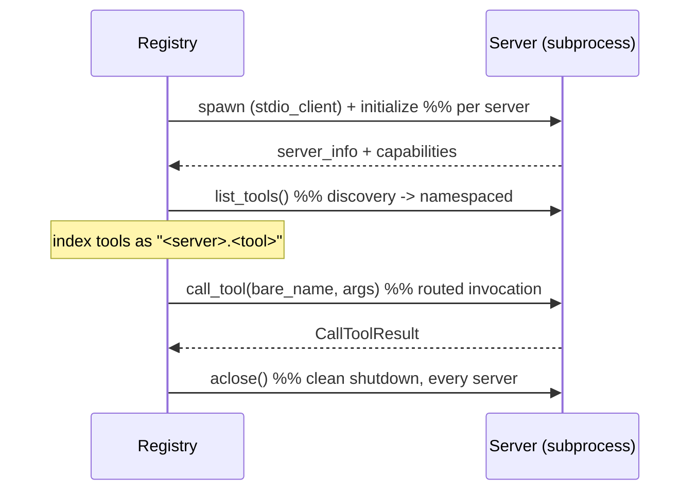

# Module 13 Concepts — Many Servers, One Host

In Module 12 you connected one client to one server and watched discovery,
invocation, and error handling across a single boundary. That is the atom. A
real host is a *molecule*: it connects several servers at once and presents them
to the agent as one coherent set of capabilities. This module is about the glue
that makes many servers behave like one — and about the new failure modes that
glue must survive.

Four problems appear the instant you connect a second server. Namespacing,
routing, health, and partial failure each solve one. The rest of this file is
those four, plus permissions and lifecycle.

## 1. Connecting multiple servers

A host doesn't run one client — it runs **one client per server**, each managing
its own subprocess and stdio session, all inside the same host process. The host
then aggregates what those clients discovered into a **single unified tool
table** the agent chooses from. The agent shouldn't care that `multiply` lives in
one process and `get_order_status` in another; it should see a flat menu of
capabilities and pick one.



Two things to read off this diagram. First, the **registry sits between the
agent and the clients** — the same host-in-the-middle principle from Module 12
(§2, §8), now doing more work: aggregation, routing, health. Second, not every
capability is an MCP server: `document_search` is a **local, in-process tool**
(Module 11). Part of the host's job is deciding *what belongs behind MCP at all*
(§7).

## 2. Tool-name collisions — why they happen

Each server names its own tools with no knowledge of the others. A `search`
server and a `docs` server might both expose a tool called `query`. A `weather`
server and an `orders` server might both expose `status`. Nothing stops this —
servers are independent programs, often from different teams or vendors.

If the host merges tool lists naively, the second `query` overwrites the first
(or worse, a call goes to the wrong server silently). The collision isn't a bug
in either server; it's an inevitable consequence of composing independently-named
namespaces. You need a rule that makes every tool name unique **and** records
which server owns it.

## 3. Namespacing — the fix

Prefix every discovered tool with the name of the server it came from, using a
separator:

```text
calculator.add          orders.get_order_status
calculator.subtract     orders.list_recent_orders
calculator.multiply
calculator.divide
```

Now `calculator.multiply` and `weather.multiply` can coexist, and the namespace
does double duty: it **guarantees uniqueness** and it **encodes the route**. To
call `orders.get_order_status`, the registry splits on the first separator,
looks up the `orders` session, and calls the bare tool name `get_order_status`
on it. Namespacing is the single mechanism behind both collision-avoidance and
routing — one idea, two payoffs.

> The host assigns the namespace (here, the name you `register()` a server
> under). Servers don't know their own prefix; that's deliberate — the host owns
> the unified view, exactly as it owns policy (Module 12 §8).

## 4. Routing across servers

Routing has two layers, and it's worth keeping them separate:

- **Capability routing (the agent's job).** Given a user question, *which tool*?
  "What is 125 × 48?" → `calculator.multiply`; "Where is TC-1234?" →
  `orders.get_order_status`; "Can I return a damaged product?" →
  `document_search` (local). This is the Module 11 router decision, now choosing
  across MCP tools *and* local tools.
- **Transport routing (the registry's job).** Given a namespaced tool name,
  *which session*? `registry.call("orders.get_order_status", {...})` splits the
  namespace, finds the right client session, forwards the bare call, and returns
  the `CallToolResult`. The agent never touches a session directly.

Keeping these apart is what lets the same registry serve a rule-based router
today and an LLM-driven one later — only the capability-routing layer changes.

## 5. Server health

With N servers, "is everything up?" stops being a yes/no. The registry tracks,
per server: is it **available**, was it **essential**, what **error** (if any)
was recorded, and how many **tools** it contributes. A `health()` snapshot makes
the fleet inspectable:

```text
calculator : available=True   essential=False  tools=4
orders     : available=True   essential=False  tools=2
weather    : available=False  essential=False  tools=0  error=Connection closed
```

Health is not decoration — it's what routing consults. A call to a tool on an
unavailable server must fail *fast and cleanly* (a returned error result), not
hang waiting on a dead subprocess. Making state visible is a course rule (design
§8.3) and here it's also operationally load-bearing.

## 6. Partial failure — essential vs nonessential

The core resilience decision: **when a server fails to connect, do you abort or
carry on?** That depends on whether the host can do its job without it.

| Class | Example | On connect failure | Rationale |
|---|---|---|---|
| **Essential** | The orders server for an order-support agent | **Abort** — raise, refuse to start | The host can't fulfill its purpose without it; limping along would mislead users. |
| **Nonessential** | An optional weather/inventory enrichment server | **Degrade** — mark it down, keep serving the rest | Losing a nice-to-have shouldn't take the whole agent offline. |

The registry encodes this with an `essential` flag at registration. `connect_all`
tries every server; a nonessential failure is recorded and skipped, an essential
failure is re-raised (after a clean shutdown). This is the multi-server analogue
of Module 12's "errors are results, not crashes" — scaled from *one tool call*
to *one whole server*.

The corresponding runtime rule: a call into a down server returns
`is_error=True` with a clear message. And a server that dies **mid-session** (its
subprocess exits after connecting) must be caught on the next call, marked
unavailable, and turned into a clean error — never allowed to crash the registry.

## 7. Permissions — which servers should the agent even see?

Module 12 §8 established that the host controls which servers exist, auth,
approval, and logging. Multiple servers sharpen the question from *"is this
server allowed?"* to *"which servers should this particular agent be exposed
to?"* Registering a server is a **permission decision**: an order-support agent
gets `orders` + `calculator`; it has no business seeing a `payments` or
`file-write` server, so the host simply never registers those for it. The
registry is where that policy lives — the agent can only route to what the host
chose to register. Discoverable-≠-permitted, now at the *server* granularity.

Keep TechCorp's safe defaults: every server here is **read-only** mock data, no
auth, no destructive actions. A server that mutates state or spends money would
demand approval controls before it earned a `register()` call.

## 8. Lifecycle management — spawn, initialize, close

Each server is a child process plus a stdio session with a strict order:



The discipline that matters: **every server you spawn, you must close** — even
the ones that failed to fully start (a partial spawn can leak a subprocess). The
reference registry gives each server its own `AsyncExitStack` so teardown is
independent: closing a healthy server can't be blocked by a dead one, and
`aclose()` is safe to call twice. In async terms, the sessions are only valid
*inside* their context managers, so the registry keeps those managers open for
its whole lifetime and tears them all down at the end — this is the #1 source of
async bugs in the lab (see lab.md debugging hints).

## Common misconceptions

- **"The agent talks to servers directly."** No — it calls the registry with a
  namespaced name; the registry owns the sessions and does transport routing
  (§4). The agent never holds a `ClientSession`.
- **"Namespacing is just for pretty names."** It's a correctness mechanism: it
  prevents collisions *and* carries the route. Drop it and two servers' identical
  tool names silently clobber each other (§2–§3).
- **"If one server is down, the agent is down."** Only if it was *essential*. A
  nonessential failure degrades gracefully; the rest keep serving (§6).
- **"A dead server crashes the host."** Not if the registry catches the broken
  session, marks it unavailable, and returns an error result (§6). A crash there
  is a bug.
- **"More servers is strictly better."** Every server is capability *and*
  liability — another process to spawn, trust, permission, monitor, and possibly
  wait on. See trade-offs.
- **"Everything should be an MCP server."** No. `document_search` stays a local
  in-process tool — a boundary you don't need is latency and failure surface you
  don't want (§7, and Module 12 §9's ladder).

## Trade-offs to internalize

- **More servers = more capability AND more failure surface + latency.** Each
  connected server adds tools, but also a subprocess to spawn, a handshake to
  wait on, a health state to track, and a trust/permission decision to make. Two
  well-chosen servers beat five you can't reason about. Add a server when the
  capability is worth the governance, not because you can.
- **Essential vs nonessential.** Marking a server essential buys correctness (the
  host refuses to run half-broken) at the cost of availability (any single
  failure is total). Marking it nonessential buys availability at the cost of
  silently reduced capability. Choose per server, per agent — there is no global
  right answer, only the question "can this agent do its job without this?"
- **Local tool vs MCP server (revisited).** MCP buys reuse, isolation, and
  language independence across hosts; a local `ToolSpec` buys simplicity, speed,
  and one fewer thing to spawn and monitor. `document_search` stays local because
  it's this app's own retrieval, not a capability other hosts need. Not every
  tool deserves a boundary (Module 12 §9).
- **Fail-fast routing vs retrying a flaky server.** Returning an immediate error
  for a down server keeps the agent responsive; transparently retrying might
  recover a blip but risks hanging the whole request. This course chooses
  fail-fast + visible health; a production host might add bounded retries with
  timeouts — a deliberate, measured addition, not a default.

Next: [lab.md](lab.md) — build the multi-server agent.
