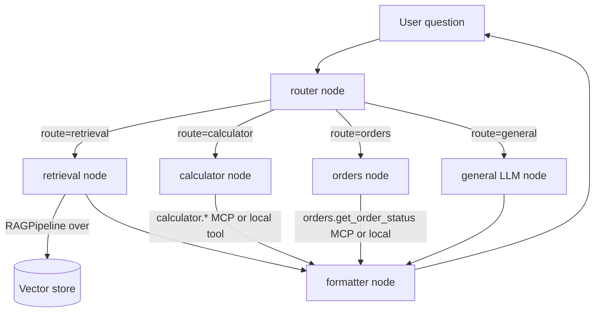

# Module 14 Concepts — Composing the Agent

Read this before the lab. Module 14 introduces almost no *new* code — its
concept is **composition**: how the pieces you already built click together into
one agent, and what properties that composition must have to be shippable.

## 1. The agent is a graph, and the graph is a router with branches

A capable agent is not one big prompt. It is a small **state machine** that
looks at each request, decides which capability answers it, runs that
capability, and formats the result. In LangGraph terms (Module 10): a router
node, a set of route nodes, and a formatter node, wired with **conditional
edges**.

Here is the v1 architecture, with the real node names from
`src/techcorp_agent/capstone/graph.py`:

The state threaded through this graph is `AgentState` (`state.py`):
`question`, `route`, `evidence`, `answer`, `sources`, `tool_result`, a `trace`
list with an `operator.add` reducer, and a `loop_count`. Each node returns a
**partial** update; LangGraph merges it. Only the `trace` accumulates; the rest
are overwrite fields (last writer wins), which is exactly right for a
single-turn pipeline.

## 2. Two routers, one decision: LLM choice with a deterministic fallback

Routing decides *which capability* answers a question. The capstone reuses the
Module 11 router unchanged:

- **`route_question`** asks the LLM to name exactly one tool via a constrained
  prompt. The model is good at reading intent — "where is my order" → the order
  tool — but it can drift (prose, a hallucinated tool name, empty).
- **`keyword_route`** is a deterministic fallback: an order id (`TC-1234`), a
  math expression or math word, or a policy keyword picks the tool from surface
  patterns. No model call — cheap, testable, always available.

`route_question` **falls back to `keyword_route`** whenever the LLM's reply is
not a clean tool name. Two consequences you will see in the lab:

- **Offline determinism.** The mock LLM never returns a valid tool name, so
  offline the router *always* uses the keyword fallback. That is what makes the
  math and order routes reproducible in tests with no key.
- **A visible gap.** The keyword fallback routes on *surface words*. "Am I
  allowed to wear **denim** at headquarters?" shares no keyword with the
  dress-code policy (which says "jeans"/"business casual"), so offline it does
  *not* route to retrieval — even though the vector store *can* retrieve the
  dress-code doc from that phrasing. A real LLM router closes this gap by
  routing on **intent**. This is the semantic-difference lesson the spec's
  sample interaction #2 is teaching: retrieval is semantic, the keyword fallback
  is not.

The graph maps the chosen tool name to a route:
`document_search → retrieval`, `calculator → calculator`,
`order_lookup → orders`, and `none`/anything-else → `general`.

## 3. Grounding lives in the retrieval node, unchanged

The retrieval node does **not** reimplement RAG — it calls the Module 08
`RAGPipeline`. That pipeline already enforces the contract: answer only from
retrieved context, **cite** the source ids it used, and **abstain** with a fixed
message when the evidence is insufficient. The node adds only an `evidence`
summary (doc ids + scores) to state for the trace.

Abstention is a *generation-time* decision, not a retrieval-time one. For an
out-of-scope question ("working from the Moon") the vector store still returns
its four nearest chunks — they are just irrelevant. The grounded prompt is what
makes the model abstain, and the pipeline detects the abstention text and drops
any sources. So "no good evidence" does not mean "empty retrieval"; it means the
model was asked to answer only from weak context and correctly declined.

## 4. Graceful degradation: a missing tool is data, not a crash

The spec is blunt: *missing MCP servers do not crash unrelated flows*. Every
route node upholds this (the pattern from Modules 11 and 13):

- **Calculator.** If an MCP registry is connected and advertises
  `calculator.*`, the node uses it; otherwise (no registry, or the server is
  down) it runs the in-process `calculator` tool. A math question is *always*
  answered.
- **Orders.** The node tries `orders.get_order_status` when available, else the
  local `order_lookup` tool. An **unknown** order (`TC-9999`) is an *expected*
  outcome — a safe "no such order" message — not an exception. A **down** order
  system returns a clear "order system unavailable" answer.
- **General / router.** Even an LLM failure in the router degrades to the
  keyword route; an LLM failure in the general node returns a polite message.

No node raises past its own boundary, so one broken capability never takes the
agent down.

## 5. The synchronous MCP bridge (a real integration wrinkle)

LangGraph nodes are **synchronous** functions, but the MCP registry is
**async**, and an MCP stdio session is **bound to the event loop that created
it** — connect it on one loop and call it from another and the call hangs. The
capstone solves this with `SyncMCPRegistry` (`mcp_bridge.py`): it runs **one**
dedicated event loop on a background thread for the registry's whole lifetime,
connects the servers there, and marshals every call onto that loop with
`asyncio.run_coroutine_threadsafe`. Graph code then just calls
`registry.call(name, args)` synchronously. This is a small but real lesson: when
you compose an async subsystem into a sync one, give the async part its own loop
and a synchronous surface — don't spin up a fresh loop per call.

## 6. The formatter keeps provenance honest

Every route ends at one `formatter` node so the output shape is consistent:
a string `answer` plus a `sources` list. The formatter's second job is
**honesty**: only the retrieval route may carry sources. A calculator result is
rendered as "The result is 1470." with **no** sources — the agent never pretends
a computed number or an order status came from the company documents. Conflating
"the model said it" with "a document says it" is the exact failure grounding was
built to prevent; the formatter is where that invariant is enforced for the
non-document routes.

## 7. Dev mode vs user mode

The same run produces two views:

- **User mode** (default) shows only the answer and its sources — what a pilot
  user should see.
- **Dev mode** (`--dev`) additionally prints the accumulated `trace`: which node
  ran, the route chosen, chunk counts, backends used. This is the seam that
  becomes real observability in Module 19; in v1 it is a plain in-state list.

## 8. What v1 deliberately does NOT have (the Level 4 roadmap)

Shipping a v1 means being explicit about scope. v1 has **no**:

- **Memory / persistence** — it forgets everything when the process exits. The
  CLI keeps an *in-memory* per-conversation history only. Durable, checkpointed
  memory across turns and restarts is **Module 15** (SQLite checkpointer).
- **Streaming or human-in-the-loop approvals** — answers arrive whole, and no
  action pauses for a human. **Module 16**.
- **Advanced retrieval** — single-pass, dense-only retrieval; no hybrid/BM25,
  no reranking, no iterative retrieval (the retrieval retry edge is a *seam*,
  capped by `max_loops`, that Module 17 fills).
- **Real observability / online evaluation** — the dev trace is a list, not a
  tracing backend. **Module 19**.
- **Guardrails / safety** and **production deployment** — **Modules 20–21**.

Naming these now is not an apology; it is what lets Modules 15–22 *extend this
codebase* instead of rewriting it.

## Common misconceptions

- **"The capstone is where I finally write the real agent."** No — it is where
  you *assemble* the components you already wrote. New code here is thin glue
  (the graph wiring, the sync MCP bridge), not new capability.
- **"Abstention means retrieval found nothing."** No — retrieval almost always
  returns its nearest chunks. Abstention is the grounded model declining to
  answer from weak evidence.
- **"If an MCP server is down the agent is down."** No — that is the whole point
  of the essential/nonessential split and the local fallbacks. A down optional
  server is a degraded feature, not an outage.
- **"The keyword router is a downgrade."** No — it is the *safety net*. The LLM
  router is the primary path; the deterministic fallback guarantees the agent
  keeps routing (and stays testable) when the model is absent or misbehaves.
- **"More MCP servers is strictly better."** No — each server is latency, a
  failure surface, and a trust/permission decision (Module 13). Compose only the
  capabilities you need.

## Practical trade-offs

- **LLM routing vs keyword routing.** LLM routing reads intent (handles
  "denim") but costs a call and can drift; keyword routing is free and exact but
  literal. The capstone uses both — LLM first, keywords as the guaranteed floor.
- **MCP vs local tools.** MCP gives you a process boundary, independent
  deployment, and language independence; a local tool gives you zero latency and
  no failure surface. The capstone keeps document search *local* and calculator
  and orders behind MCP, and every MCP route has a local fallback.
- **A single formatter vs per-route formatting.** One formatter guarantees a
  consistent shape and one place to enforce provenance, at the cost of a little
  indirection. For a shippable agent, the consistency is worth it.
- **Bounded retries vs open-ended agentic loops.** v1 caps retrieval retries at
  `max_loops` so the graph is provably finite. Open-ended tool-use loops are
  more powerful but need their own budget and monitoring — a Level 4 concern.
