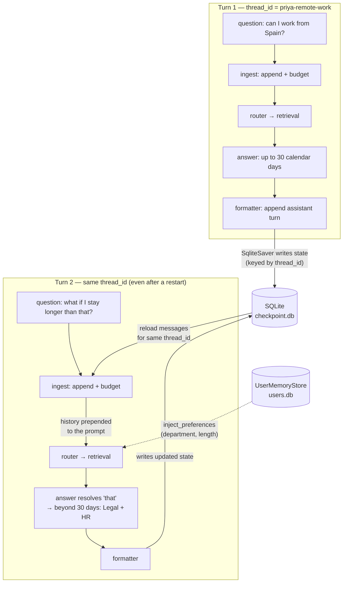

# Module 15 Concepts — Memory and Persistence

> Read this before the lab. It explains why the v1 agent forgets everything, the two kinds of memory an assistant needs, what a checkpointer actually persists, the trimming-vs-summarization trade-off, and the privacy obligations that come with storing conversations.

## Why v1 forgets everything

The capstone agent from Module 14 is **stateless between invocations**. Look at its shape:

- `AgentState` (in `capstone/state.py`) has a single `question` and a single `answer`. There is no list of prior turns.
- `build_graph(...)` compiles with **no checkpointer**: `graph.compile()`. Nothing is written anywhere.
- The CLI keeps a `history` list, but it is *in-memory only* and, critically, it is never fed back into the prompt — and it vanishes when the process exits.

So each call to `graph.invoke({...})` starts from a blank slate. The model sees only the current question plus the retrieved documents. Ask a follow-up and the word "that" points at nothing. This isn't a bug in v1 — it was the right scope for a one-shot pilot. It is simply the wall a *conversational* rollout hits, and the wall this module tears down.

## Short-term vs long-term memory

An assistant employees actually talk to needs two different kinds of memory, and conflating them causes real bugs:

| | Short-term memory | Long-term memory |
|---|---|---|
| **Scope** | one conversation (a `thread_id`) | one user, across all conversations |
| **Holds** | the message history of *this* chat | durable facts: department, preferred answer length, timezone |
| **Lifetime** | until the conversation is done (or trimmed) | indefinitely, until updated or erased |
| **In this module** | the SQLite **checkpointer** | the SQLite **`UserMemoryStore`** |

Priya's question "what if I stay longer than that?" is answered by *short-term* memory — the earlier turn is right there in the thread. But "she's in Engineering and prefers short answers" is a *long-term* fact that should apply the next morning, in a brand-new conversation, on a different thread. Two mechanisms, because they have two different scopes and lifetimes.

## Checkpointers and thread IDs

A **checkpointer** is a LangGraph component that saves the graph's state after every step and reloads it before the next invocation. You opt in at compile time:

```python
from langgraph.checkpoint.sqlite import SqliteSaver

saver = SqliteSaver(sqlite3.connect("conversation.db", check_same_thread=False))
saver.setup()  # create the checkpoint tables once
graph = builder.compile(checkpointer=saver)
```

Then every invocation names a **thread** via config:

```python
config = {"configurable": {"thread_id": "priya-remote-work"}}
graph.invoke({"question": "..."}, config=config)  # turn 1
graph.invoke({"question": "..."}, config=config)  # turn 2 — sees turn 1
```

The `thread_id` is the conversation's identity. Same id → same running state, continued. Different id → a separate, isolated conversation. **This is the whole trick behind multi-turn memory.** In our graph the state carries a `messages` list with an *append reducer* (the Module 10 pattern), so each turn adds to the transcript instead of overwriting it; the checkpointer persists that list, and the next turn reloads it and prepends it to the prompt.

> **Note on the API.** `SqliteSaver.from_conn_string(path)` is a *context manager* — it closes the database when the `with` block exits, which is wrong for a graph that must outlive the call. So the library constructs `SqliteSaver(sqlite3.connect(...))` directly and owns the connection. It also hands the saver a serializer that explicitly allows our `ChatMessage` type across the disk round-trip (langgraph 1.2 warns on unregistered types).

### What a checkpointer actually persists

This is the most common point of confusion. A checkpointer persists **the graph's state values** — for us, the `messages` transcript plus the per-turn fields — keyed by `thread_id` and by a checkpoint id per step. It writes them to durable storage (here, SQLite).

It does **not**:

- persist your Python objects' identity or in-memory caches;
- persist the LLM's "memory" (the model itself is stateless — it only ever knows what is in the current prompt);
- store long-term user facts (that is a separate store, by design).

Because the state is on disk, a *new process* — a restarted server, a different worker — that opens the same database and uses the same `thread_id` continues the exact conversation. That is what Lab A demonstrates: we `del` the graph entirely and build a fresh one on the same file, and the follow-up still resolves.

## Message trimming vs summarization

Every turn we replay, the prompt grows. And a prompt is a **finite context window** — the same hard limit you counted tokens against in Module 01. Left unchecked, a long conversation eventually overflows the window (or just gets slow and expensive). You have two levers:

- **Trimming** drops old turns outright — keep the last *N*, discard the rest. Cheap and simple, but it *forgets*: whatever you drop is gone. If turn 2 said "my order was TC-2048" and you trim it, turn 9 can't recover it.
- **Summarization** replaces the older turns with one compact **summary message** and keeps the recent turns **verbatim**. The gist of the old turns survives in far fewer tokens; the recent turns — the ones a follow-up most likely refers to — stay exact.

This is the module's central trade-off: **summarization trades fidelity for budget.** You spend an extra LLM call (and lose some detail) to fit more history into the same window. `apply_budget(llm, messages, max_tokens)` is the one-liner: within budget it changes nothing; over budget it summarizes older turns and returns `(messages, True)`. Lab B shows the before-and-after so you can *see* what was compressed and what was kept.

Why keep the *recent* turns verbatim rather than the oldest? Because conversational reference is local — "that", "it", "the second option" almost always point at the last few turns. Preserving the tail exactly is where fidelity matters most; the distant past can safely become a summary.

## Memory is not the context window

A subtle but load-bearing distinction:

- The **context window** is what the model sees on a single call — a fixed token budget, gone the moment the call returns.
- **Memory** is what your *application* chooses to persist and replay into future context windows.

The model has no memory of its own; it is stateless. Every apparent "it remembers" is your code putting prior information back into the prompt. Memory (checkpointer + store) and context window (the per-call budget) are different things that meet at one point: the prompt you assemble each turn. Summarization exists precisely because memory can grow without bound while the context window cannot.

## Long-term stores for durable facts

Short-term memory ends with the conversation. For facts that should outlive it — "Priya is in Engineering", "she prefers short answers" — you need a store scoped to the *user*, not the thread. LangGraph 1.2 ships a `langgraph.store` API (`BaseStore` / `SqliteStore`) built around namespaced, embedding-indexed items; it is powerful but heavier than this lesson needs, and its search shape would distract from the one idea we're teaching. So the library uses a tiny, transparent SQLite key/value store of its own — one table, `remember` / `recall` / `forget` — that you can read end to end and inspect with the `sqlite3` CLI.

`inject_preferences(messages, prefs)` turns a recalled `{key: value}` dict into a single `system` note prepended to the prompt ("Known facts about the current user: department: Engineering; ..."). Lab C stores facts in one session and applies them in a *separate* session on a new thread — proving the facts are durable and cross-conversation.

## Privacy considerations (and the GDPR tie-in)

The moment you persist conversations and user facts, you are storing **personal data**, and TechCorp's privacy obligations attach. This is not optional polish — it is a requirement the Legal team enforces (see `data/privacy/`).

- **Data minimization.** Store what the assistant needs, not everything a user ever typed. A durable fact ("prefers short answers") is proportionate; the full verbatim transcript of every chat retained forever is usually not. Summarization helps here too — it naturally discards detail you no longer need.
- **Retention limits.** TechCorp's Data Retention Policy retains account data only as long as needed and deletes it on schedule (account data is purged 30 days after a deletion request). Conversation logs and stored user facts fall under the same principle: define a retention period, don't keep them indefinitely by accident.
- **Right to erasure.** GDPR gives EU users the right to have their data deleted. A memory store therefore needs a *deletion path* — this is why `UserMemoryStore` has `forget(user_id, key=None)`: you must be able to erase one fact or a whole user on request.
- **Access and isolation.** Thread ids and user ids must not leak across users. Isolation isn't just a correctness property (Lab A's third test) — it's a confidentiality one.

If you store customer personal data in memory, the same lawful-basis, retention, and deletion rules from `data/privacy/gdpr_summary.md` apply. When in doubt, minimize and involve Legal — the same answer the agent itself gives about long international stays.

## Misconceptions

- **"The LLM remembers the conversation."** No. The model is stateless; your application replays history into each prompt. "Memory" is an application feature, not a model feature.
- **"A checkpointer saves my objects."** It saves the graph's **state values**, serialized, keyed by thread — not arbitrary Python objects or caches.
- **"Long-term memory is just a longer context window."** Different mechanism entirely. Long-term facts live in a durable store scoped to the *user* and are injected selectively; the context window is a per-call token budget.
- **"Summarization loses everything old."** It compresses, not deletes — the gist survives, and the recent turns stay verbatim. It's trimming that discards.
- **"More history is always better."** More history costs tokens, latency, and money, and can bury the relevant turn in noise. Budgeting is a feature, not a limitation.
- **"Storing chats is free."** It carries retention, deletion, and access obligations under GDPR. Persistence is a data-governance decision, not only an engineering one.

## Trade-offs at a glance

- **Trimming vs summarizing** — trimming is cheap and lossy; summarizing spends a call to preserve the gist. Choose per turn based on the budget.
- **How much to keep verbatim** (`keep_recent`) — larger keeps more fidelity but leaves less room for the summary and new content; smaller compresses more aggressively.
- **Budget size** (`max_history_tokens`) — bigger budget = better recall but higher cost/latency; smaller = cheaper but summarizes sooner.
- **What to store long-term** — durable, high-value facts (preferences, department) earn their keep; storing everything invites privacy risk and prompt bloat.
- **SQLite here vs a managed store in production** — SQLite is perfect for teaching and single-node deployments; a company-wide rollout (Module 21) may move to a networked store, but the *concepts* — threads, checkpoints, budgets, durable facts — are identical.

## Thread state flow



The checkpointer (`checkpoint.db`) carries the **conversation** across turns and restarts; the `UserMemoryStore` (`users.db`) carries **durable user facts** across conversations. Together they turn a stateless one-shot into an assistant that remembers.
