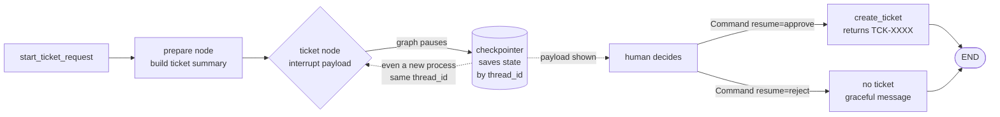

# Concepts — Streaming and Human-in-the-Loop

Two independent ideas share this module because they meet at the same place — the
boundary between the agent and the human — from opposite directions. Streaming is
about **showing more, sooner**. Human-in-the-loop (HITL) is about **doing less,
until asked**. One improves how the agent *feels*; the other constrains what it is
*allowed to do*.

---

## 1. Perceived latency vs actual latency

**Actual latency** is how long the work takes: the model has to generate, say, 200
tokens, and that takes ~2 seconds no matter what. You usually cannot make it
faster.

**Perceived latency** is how long it *feels*. If the user sees nothing for 2
seconds and then the whole answer, it feels like a 2-second freeze. If the first
words appear in 200 ms and the rest flow in as they are generated, the *same*
2-second call feels responsive — the user is reading while the model is still
writing.

Streaming does not reduce actual latency. It reduces perceived latency, and
perceived latency is what users judge you on. This is why every serious chat UI
streams: it is the cheapest, largest UX win available.

> Misconception: "streaming makes the model faster." It does not. It changes
> *when* you see the output, not *how long* the output takes to produce.

---

## 2. Token streaming vs event streaming — two feeds, two consumers

These are different things for different audiences. Do not conflate them.

| | Token streaming | Event streaming |
|---|---|---|
| **What flows** | pieces of the *answer text* | records of *what the graph is doing* |
| **Consumer** | the **human** reading the reply | a **UI / monitor / log** watching the run |
| **Example chunk** | `"jeans "`, `"are "`, `"fine"` | `node 'router' updated ['route']`, `route selected: retrieval` |
| **In this repo** | `StreamingLLM.stream_complete()` | `stream_agent_events(graph, state)` |

Token streaming answers *"what is the model saying?"* Event streaming answers
*"what is the agent doing?"* — which node ran, which route it picked, when it
paused. A CLI prints events as status lines; a web UI turns them into a progress
indicator (Module 21 feeds the very same `AgentEvent` records over Server-Sent
Events — it reuses this normalizer rather than reinventing one).

```python
# token stream — for the human
for chunk in llm.stream_complete(messages):
    print(chunk, end="", flush=True)  # answer types itself

# event stream — for a UI / monitor
for event in stream_agent_events(graph, state):
    print(f"· {event.summary}")  # nodes light up in order
```

---

## 3. LangGraph stream modes

`graph.stream(state, config, stream_mode=...)` is the single entry point; the mode
decides the *shape* of what you get. Verified against the installed LangGraph
(1.2.10) by running each mode on the capstone graph:

| `stream_mode` | Yields (per step) | Use it for |
|---|---|---|
| `"updates"` | `{node_name: partial_update}` — only what that node changed, one dict per node, **in execution order** | watching nodes fire and routes get chosen (Lab B) |
| `"values"` | the **whole** accumulated state after each step | seeing the full state snapshot evolve |
| `"messages"` | LLM tokens `(token, metadata)` for nodes that call a chat model | token-streaming *through* the graph (chat-message graphs) |

Our `stream_agent_events` builds on `"updates"` because that mode names the node
and shows exactly its delta — perfect for "router updated `route`; route selected:
retrieval". A paused graph surfaces a special `__interrupt__` update in this same
stream, which is how the event feed knows to emit an `interrupt` event.

Observed on the capstone graph, `stream_mode="updates"`:

```text
['router']
['retrieval']
['formatter']
```

---

## 4. Interrupts and approval gates

An **interrupt** is a graph pausing itself, on purpose, mid-run. Inside a node you
call:

```python
from langgraph.types import interrupt

decision = interrupt(payload)  # graph STOPS here; nothing below runs yet
```

`interrupt(payload)` does two things: it hands `payload` out to the caller (so a
human can see *exactly* what is about to happen) and it suspends execution at that
line. The graph is now paused. Later, a human resumes with:

```python
from langgraph.types import Command

graph.invoke(Command(resume=decision), config)  # interrupt() returns `decision`
```

Execution restarts *at the interrupt*, `interrupt(...)` returns the resume value,
and the node continues. This is an **approval gate**: pause → show the human the
exact effect → act on their yes/no.

The payload must describe the real effect ("a support ticket will be created with
this summary and order id"), because an approval the human cannot understand is
not consent.

---

## 5. Resumable execution *requires* a checkpointer — the Module 15 tie-in

Pausing is only useful if the paused state is *saved somewhere*. Between the
interrupt and the resume, the graph's state — which node it's at, the values it had
computed — has to live somewhere the resume can read it. That "somewhere" is a
**checkpointer**, the exact abstraction Module 15 introduced.

```python
graph = build_approval_graph(llm, checkpointer=MemorySaver())  # in-process
graph = build_approval_graph(llm, checkpointer=SqliteSaver(conn))  # survives restart
```

- `MemorySaver` — state lives in RAM. Fine for one process; gone on exit.
- `SqliteSaver` — state lives in a file, keyed by `thread_id`. A **brand-new
  process** can open the same file, load the same `thread_id`, and resume the
  pending approval. That is Lab D: approve tomorrow, from a different run.

This is why `build_approval_graph` **rejects `checkpointer=None`** loudly.
Interrupt-without-a-checkpointer is a contradiction: there would be nowhere to
suspend to.



---

## 6. Which actions deserve approval — and which do not

Back in Module 11 the rule was: **tools are read-only unless a lab teaches
approval.** This is that lab, and the rule sharpens into a principle.

Gate an action when it is one of:

- **A write** — it makes something exist in the outside world (creates a ticket,
  sends an email, updates a record). A wrong write is a real artifact someone must
  clean up, not a sentence you can ignore.
- **An escalation** — it pulls in a human, a manager, or another team.
- **Spending** — it costs money or consumes a limited resource.

Do **not** gate reads. Retrieval, a calculator, an order *lookup*, a chat reply —
none of these change the world, so an approval prompt on them is pure friction that
trains users to click "approve" without reading. In this module exactly one action
is gated — `create_ticket`, the graph's only write — and the rest of the capstone
agent stays un-gated. Keeping the gate narrow is what keeps it meaningful.

---

## Trade-offs

- **Streaming complexity vs UX.** Streaming means you can no longer treat a reply
  as one string you get at the end — you handle a sequence, flush output as it
  arrives, and reassemble when you need the whole thing (`collect`). More moving
  parts, in exchange for an app that feels alive. Almost always worth it for
  anything a human waits on.
- **Approval friction vs safety.** Every gate is a human interruption. Too many
  gates and people rubber-stamp everything, which is worse than no gate — it
  *looks* safe while being safe about nothing. Gate the few actions that are
  genuinely irreversible or costly, and make the payload readable, so each
  approval is a real decision.
- **Token vs event streaming are not substitutes.** A monitor wants events, not
  half-sentences; a reader wants the answer, not `node 'router' ran`. Shipping the
  wrong feed to the wrong consumer is a common mistake — pick per audience, or
  (stretch) interleave both.

---

## Recap

- Streaming lowers *perceived* latency, not actual latency.
- Token streaming (answer text → human) and event streaming (graph activity →
  UI/monitor) are distinct feeds for distinct consumers.
- LangGraph `stream_mode`: `updates` (per-node delta), `values` (full state),
  `messages` (LLM tokens).
- `interrupt(payload)` pauses a graph and shows the human the exact effect;
  `Command(resume=...)` continues it.
- Resumable interrupts **require a checkpointer** — the Module 15 abstraction —
  and a durable one (Sqlite) lets a pending approval survive a restart.
- Gate writes, escalations, and spending; never gate reads.
