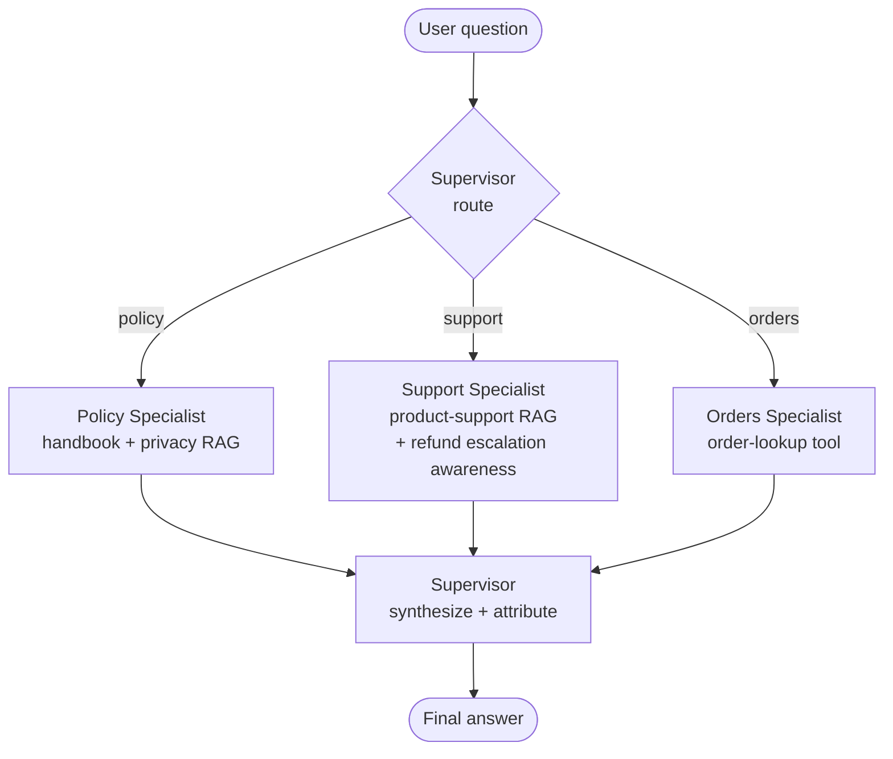

# Module 18 Concepts — Multi-Agent Systems

Read this before the lab. The lab asks you to measure a supervisor system
against a single agent and decide which to ship; these concepts are the
vocabulary and the honesty you need to make that call.

---

## 1. When one agent with many tools stops scaling

The Module 14 capstone is a single agent: one router chooses among four routes
(retrieval, calculator, orders, general), and one system prompt has to describe
everything the agent can do. That works well — until it doesn't. Two failure
modes show up as you add capability:

**Prompt bloat.** Every tool, every policy nuance, every "do this but not that"
rule lives in one prompt. As it grows, the model has more to hold in working
attention and more chances to apply the wrong rule. The prompt becomes a
maintenance liability: change the refund wording and you risk the vacation
answer.

**Tool confusion.** This is the Module 11 problem, scaled up. Routing quality
depends on the tool *descriptions* being distinguishable. With four tools that
is easy. With a dozen overlapping ones — `search_hr_docs`,
`search_support_docs`, `search_privacy_docs`, `lookup_order`,
`refund_calculator`, `escalation_checker` — the descriptions start colliding,
and the router picks the plausible-but-wrong tool. You saw the seed of this in
the capstone's routing report: a "refund over $500" question is *both* a
support-policy question and an escalation question, and a single router has to
collapse that into one choice.

The supervisor pattern is a structural answer to both: instead of one prompt
that must describe everything, give each domain its own small agent with its own
small prompt and its own small tool set, and put a coordinator on top.

---

## 2. The supervisor pattern

A **supervisor** is a coordinator agent whose only job is to (1) decide which
specialist should handle a question, (2) hand the question off, and (3) turn the
specialist's result into a final answer. It does not answer domain questions
itself.

Routing reuses the Module 11 defense verbatim: an **LLM-constrained choice**
(the model is asked to name exactly one specialist) with a **deterministic
keyword fallback** (if the model's reply is not a valid specialist name, route
on surface patterns — an order id, support words, policy words). Offline, the
mock never returns a valid name, so the fallback carries routing — which is
exactly why the fallback exists and why routing works with no API key.

---

## 3. Specialists: focused prompts, small tool sets

A specialist is *specialist* because of what it **cannot** do:

- **PolicySpecialist** — RAG scoped to the `employee_handbook` and `privacy`
  categories. It literally cannot retrieve a product-support chunk, so it cannot
  be distracted by one. No calculator, no order lookup.
- **SupportSpecialist** — RAG scoped to `product_support`, with refund/escalation
  awareness baked into its prompt: any refund over $500 requires Tier 2 manager
  approval (a fact that lives in the `support-escalation` document). Its job is
  to surface that when the retrieved context supports it.
- **OrdersSpecialist** — one read-only order-lookup tool and a formatter. In the
  offline path it makes *no LLM call at all*: extract an order id, look it up,
  format the record. The "small tool set" idea at its limit — one tool.

Compare the three short specialist prompts to the one prompt a single agent
would need to hold all of that at once. The combined length is similar; the
difference is that no *single* model call ever has to reason over all of it.
That is the focus you are buying.

> **Design note (in the code):** the specialists here are plain callable classes,
> not LangGraph subgraphs. Each is a single deterministic pass
> (retrieve-then-answer, or look-up-then-format) with no branching or retry, so a
> subgraph would be ceremony that hides the point. Simpler is better *until* a
> specialist grows its own loop (e.g. Module 17's iterative retrieval) — then
> promoting that one specialist to a subgraph is the right call.

---

## 4. Handoffs and shared vs private state

A **handoff** is the supervisor passing control to a specialist. The critical
design decision is *how much state travels with it.*

**Private state (what we do):** the supervisor passes the specialist only the
**question** (plus minimal context) — not the whole conversation, not the other
specialists' scratch work. The specialist sees exactly what it needs to do its
one job and nothing else.

**Shared state (the tempting mistake):** dumping the entire running
conversation into every handoff. It feels convenient, but it means:

- **more tokens** on every specialist call (you pay to re-send context the
  specialist will not use);
- **more ways to confuse** the specialist (irrelevant history is noise);
- **more ways to leak** (a support specialist does not need the user's HR
  history).

Keep the shared surface small. The supervisor owns the conversation; the
specialists borrow only a question.

---

## 5. The real costs (this is the module)

Multi-agent designs are not free. Name the costs honestly:

- **Tokens.** Every hop is an LLM call. The supervisor spends a routing call on
  *every* question before any specialist runs, and — if you enable synthesis — a
  second call to rewrite the answer. That is strictly more tokens than a single
  agent for the same question. Offline, against the mock, this delta is exact
  and repeatable (more calls = more tokens, and the mock computes usage
  deterministically) — so you can measure it with no API key.
- **Latency.** Calls are sequential: route, then answer, then maybe synthesize.
  Two or three round trips where the single agent had one. Latency compounds
  with every hop you add.
- **Debugging difficulty.** This is the one people underestimate. A bug in a
  single agent is a stack trace. A bug in a multi-agent system is a
  *distributed-systems* bug: *why* did the supervisor route this question here,
  *why* did that specialist abstain, *where* did the citation get dropped? You
  now debug an interaction between components, not a single call stack.

### The synthesis trade-off

The supervisor can either **pass the specialist's answer through** (cheap: no
extra call; the specialist already produced a grounded, cited answer) or spend a
**synthesis LLM call** to rewrite everything into one smooth voice (a real extra
call, more tokens, more latency — and a risk of paraphrasing away a precise
number or dropping a citation). Neither is universally right. The lab makes you
turn synthesis on, measure the premium, and judge whether it bought anything.

---

## 6. When you would NOT choose multi-agent

Do not reach for a supervisor just because you can. Prefer the single agent
when:

- **The single agent already answers correctly.** If a specialist would cite the
  same sources and fail no more often, the supervisor only added calls, tokens,
  and latency. Same answer, higher cost → ship the single agent.
- **You have a handful of clearly-distinct tools.** Prompt bloat and tool
  confusion are the *reasons* to split. If the router is not yet confused, you
  do not yet have the problem the pattern solves.
- **Latency or cost is tight.** Every hop is a round trip and a bill.
- **You cannot yet observe the system.** Debugging a multi-agent system without
  tracing (Module 19) is guessing. If you cannot see which specialist ran and
  why, you are not ready to run several of them.

The right time to go multi-agent is when a single prompt has grown too large to
route reliably, *or* when a focused specialist measurably improves answer
quality on its domain — and you can prove it with the comparison you build here.

---

## Misconceptions

- **"More agents = more intelligence."** No. More agents = more coordination
  overhead. Each agent is the same model; splitting the work does not make the
  model smarter, it changes *what each call has to attend to*. The win (when
  there is one) is focus, not raw capability.
- **"A supervisor is always more accurate."** Only if a specialist actually
  outperforms the single prompt on its domain. Absent that, the supervisor
  spends more to arrive at the same answer.
- **"Synthesis makes the answer better."** Synthesis makes the answer *smoother*
  and costs a call; it can also paraphrase away a precise policy number or drop a
  source. Better voice, not necessarily better facts.
- **"Multi-agent is the advanced/correct architecture."** It is *an*
  architecture with a specific cost/benefit profile. The engineering skill is
  choosing it when the trade pays off and refusing it when it does not — which
  is exactly what the completion criterion asks you to articulate.

---

## Trade-offs at a glance

| | Single agent (Module 14) | Supervisor multi-agent |
|---|---|---|
| Prompt | one large prompt (bloat risk) | several small focused prompts |
| Tool confusion | grows with tool count | contained per specialist |
| LLM calls / question | 1 route (+1 answer) | 1 route + 1 specialist (+1 synthesis) |
| Tokens | lower | strictly higher |
| Latency | one hop | two-plus sequential hops |
| Debugging | a stack trace | a distributed-systems problem |
| Best when | few distinct tools, cost-sensitive | prompt too big to route, or a specialist measurably wins |
