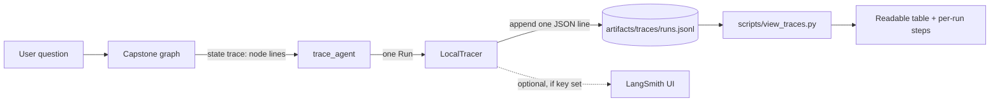

# Module 19 — Concepts

Read this before the lab. Act 3 of the TechCorp story is about *trust at scale*: leadership has stopped asking "can you build it?" and started asking "how do you **know** it works, and how do you know your last change didn't break it?" This module gives you the two answers an engineer is allowed to give — a **trace** (what the agent actually did) and an **experiment** (a measured before/after on a fixed dataset) — and the discipline that ties them together.

---

## 1. "It seems to work" is not an engineering answer

When you demo the agent by typing three questions you already know the answers to, you are not testing the agent — you are testing your memory of the happy path. "It seems to work" fails as an engineering answer for three concrete reasons:

- **It doesn't survive a follow-up question.** "Works on what? How often? Which questions fail?" has no answer, so you can't prioritise a fix or defend a release.
- **It has no baseline.** Without a recorded number from *before* your change, "it's better now" is a feeling, not a finding. You cannot detect a regression you never measured.
- **It hides the failure distribution.** An agent that is 95% correct and an agent that is 60% correct both "seem to work" on a five-question demo. The gap only shows up when you run *all* your examples and count.

The fix is not heroics; it is **records and measurement**. Every run leaves a trace you can inspect, and every change is validated against a fixed dataset whose numbers you can compare. That is the whole module.

---

## 2. Traces, runs, and spans

A **trace** is the recorded story of one execution. The vocabulary is worth getting exactly right because LangSmith (Section 4) uses the same words:

| Concept | What it is | In our `LocalTracer` | In LangSmith |
|---|---|---|---|
| **run** | one top-level invocation (one user question end to end) | one `Run`, written as one JSONL line | a root run |
| **step / span** | one unit of work *inside* a run (a node visited, a tool called) | one entry appended by `run.log_step(node, data)` | a child run (a nested span) |
| **inputs / output** | what went in, what came out | `run.inputs`, `run.set_output(...)` | run inputs / outputs |
| **metrics** | tokens and latency for the run | `run.set_metrics(tokens, latency_ms)` | run metadata (usage, latency) |
| **error** | the failure, if the run raised | the `error` field (set automatically) | the run's error status |

The capstone graph already writes a plain-text trace line per node into `state["trace"]` (`[node=router] tool=document_search route=retrieval`). Module 19 does **not** rewrite that — it *reads it back*: `trace_agent(graph, question, tracer)` invokes the graph, parses those lines into ordered steps, and records the route, answer, sources, tokens, and latency. One accumulating record per run, on disk, greppable.

**Why JSONL?** One JSON object per line is append-only (safe for concurrent runs behind a lock), needs no schema migration, and you can read a single record with your eyes or `grep` without a parser. It is the honest local stand-in for a hosted trace database.

---

## 3. Cost and latency, tracked per run

A trace that records *what* happened but not *what it cost* can't answer the other half of leadership's question ("can we afford this at scale?"). So every run also carries:

- **token usage** — input/output/total tokens. Offline, the mock client records every prompt in `.calls`, so `trace_agent` approximates tokens the same way the mock counts them (~4 chars/token); with a real client the usage is exact. Multiply by your per-1M-token rates (Module 02's `costs.py`) and you have per-run cost.
- **latency** — wall-clock milliseconds around the invocation, measured by the tracer automatically.

Aggregate these across many runs and you get the operational picture: a **p50/p95 latency** (most runs are fast, but what does the slow tail look like?) and a cost-per-question. The viewer prints p50/p95; adding richer percentiles is a stretch goal in the lab.

---

## 4. LangSmith: projects, datasets, experiments, feedback

[LangSmith](https://smith.langchain.com) is LangChain's hosted observability and evaluation platform. It is the **recommended live path** for this module, but it is strictly optional — everything runs on the local fallback with no account. When a learner has a free `LANGSMITH_API_KEY`, the same runs mirror to the UI. Its four core objects map onto what you build locally:

- **Project** — a named bucket of runs (e.g. `techcorp-agent`). Our JSONL file is one project's worth of runs.
- **Dataset** — a fixed set of examples with expected outputs. *We already have one*: `data/evaluation/eval_dataset.json` from Module 09. In the live path you'd upload it; offline you load it directly.
- **Experiment** — one run of a system over a dataset, scored. Our `run_experiment(...)` is exactly this: it runs each example through a pipeline, traces it, and scores it with the deterministic metrics. Two experiments over the same dataset are comparable — that is how you catch a regression.
- **Feedback** — a score attached to a run (from a human, a heuristic, or an LLM judge). Our `combine_scores(...)` output is feedback: a `passed`/`score` verdict per example.

The bridge (`techcorp_agent.tracing.langsmith_bridge`) uses the low-level LangSmith SDK: `Client.create_run(name, inputs, run_type, id=...)` then `Client.update_run(run_id, outputs=..., end_time=..., error=...)` — the same two-call pattern the `@traceable` decorator wraps. When no key is set, `enabled()` returns `False` and the bridge is a silent no-op.

---

## 5. LLM-as-judge — combined with deterministic checks, **never alone**

Some quality questions are invisible to a substring check. "You get twenty-five days off" is a correct answer to a vacation question, but Module 09's `fact_coverage` (a verbatim substring match) scores it **0** because the string "25 vacation days" isn't present. An **LLM-as-judge** — a model prompted with a rubric to score an answer against the evidence — catches paraphrases, subtle factual errors, and confident non-answers that the deterministic metrics miss.

So use a judge. But the **spec rule for this entire course is absolute: the judge is never the only validation.** Three reasons, and they are not bureaucratic:

1. **Circularity.** Grading an LLM's output with an LLM can reward the exact blind spot that produced the error (both models share training biases). A deterministic check — "is the cited source id actually in the expected set?" — has no shared bias with the generator; it is an independent witness.
2. **Drift.** Judge scores wander as the judge model, its prompt, or its temperature change. A "the score went up" claim built on the judge alone is not reproducible next month. Deterministic checks give the same number forever.
3. **Cost.** Every judged example is an extra model call — real money and latency on a large dataset. The judge earns its keep only where the cheap checks are blind.

The contract that encodes this is `combine_scores(deterministic, judge)`:

> **Deterministic checks gate. The judge only refines.**
> If a required deterministic check fails, the example fails — `passed=False`, `score=0.0` — **regardless of what the judge said** (a glowing judge can never rescue a missing citation). Only when the gate passes does the judge shape the *magnitude* of the passing score.

This is the same stance as Module 09's report: "a model-based evaluator may be layered on top, but must never be the only validation method."

---

## 6. Regression testing: treat prompts like code

You would never merge a code change without running the test suite. A prompt is code — a change to the system prompt, a new few-shot example, a "simplification" that drops a rule can silently break behaviour that used to work. **Regression testing** applies the same discipline: run the *same dataset* through the *old* and the *new* system, and compare.

`compare_experiments(baseline, candidate)` does this:

- **per-metric deltas** on the aggregates (`candidate - baseline`); a negative delta on any metric is a warning sign.
- a **`regressions` list**: the individual examples whose overall score *dropped*, named by id, with exactly which metrics moved. This is the load-bearing output — an aggregate can stay flat while specific examples silently break, so you compare per example, not just the headline.

In Lab C you'll drop the citation rule from the RAG prompt (by *composition* — never editing shared code, see below), re-run, and watch `source_accuracy` fall and eight specific examples appear in the regression list. That is the completion criterion made concrete: you can answer "how do you know your change improved the agent?" with a table, not a feeling.

### Why override, never mutate, the shared code

Lab C needs a *worse* pipeline, but the shared `RAGPipeline` and its prompt are used by every other module — editing them would break Modules 08, 09, 14, 17. The professional move is **composition over mutation**: wrap the shared pipeline in a thin function that changes only the one thing under test (here, whether the answer carries a `SOURCES:` line). The experiment gets its variant; the shared code stays intact for everyone else. This is exactly how you'd run an A/B on a prompt in production without forking your codebase.

---

## 7. Misconceptions and trade-offs

**Misconception: "more tracing is always better."** Tracing has a cost — write latency, disk, and noise. The trade-off is **observability overhead vs debuggability**: record enough to reconstruct any run (nodes, route, tokens, latency, error) but not so much that the log is unreadable or the write dominates the run. One line per run, steps summarised, is the sweet spot for this course; a production system tunes sampling rates for the same reason.

**Misconception: "the aggregate number is the answer."** A flat overall score can hide a real regression — some examples improved, others broke, and they cancelled. Always read the per-example regression list, not just the headline delta.

**Misconception: "a passing judge means the answer is good."** Only if the deterministic gate also passed. The judge refines; it does not gate.

**Misconception: "offline numbers are the real numbers."** With the mock LLM and hash embeddings, the *generation-side* metrics describe the mock, not any real model — only the retrieval-side numbers (hit@k) are meaningful offline. The machinery is real and reproducible; the absolute values change with a real model. Module 09's report says the same thing, and it's why every report records its run context (which embeddings, which LLM).

**Trade-off: local fallback vs hosted platform.** The JSONL log is free, private, and dependency-light, but it has no UI, no team sharing, and no built-in charts. LangSmith adds all of those at the cost of an account and sending your traces to a third party. The right default for a lab — and for a first prototype — is local; you graduate to the hosted platform when a *team* needs to share and search traces.
