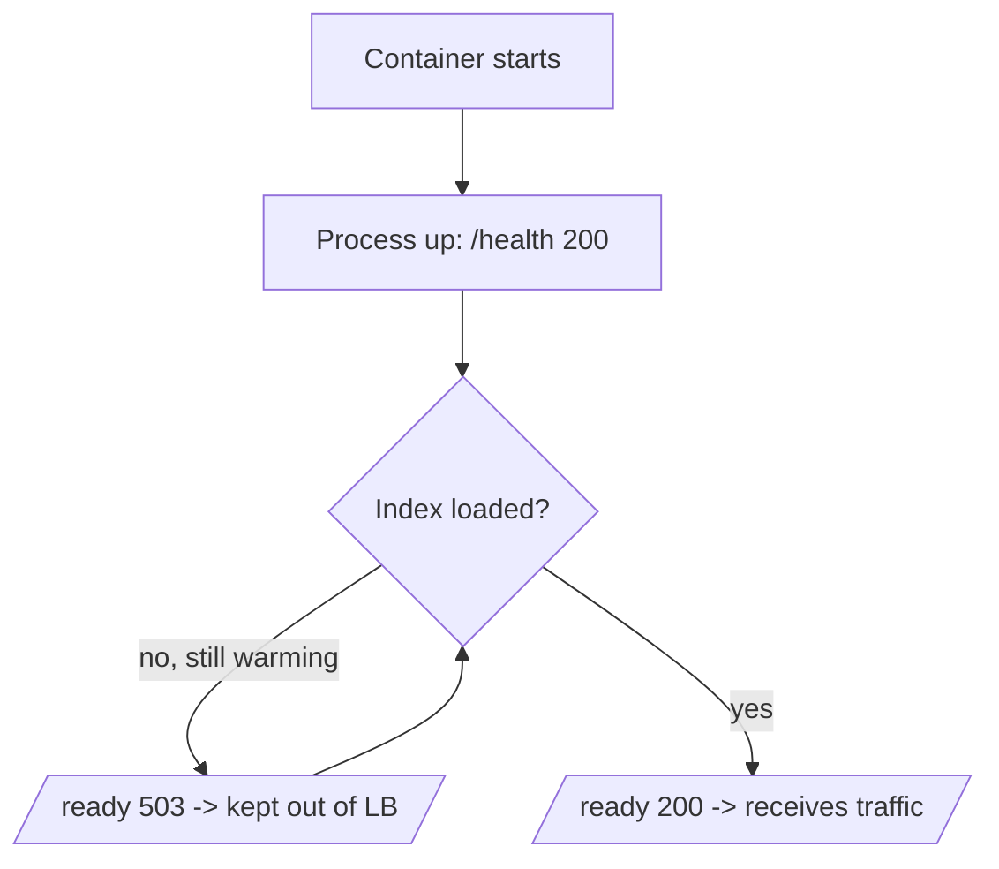
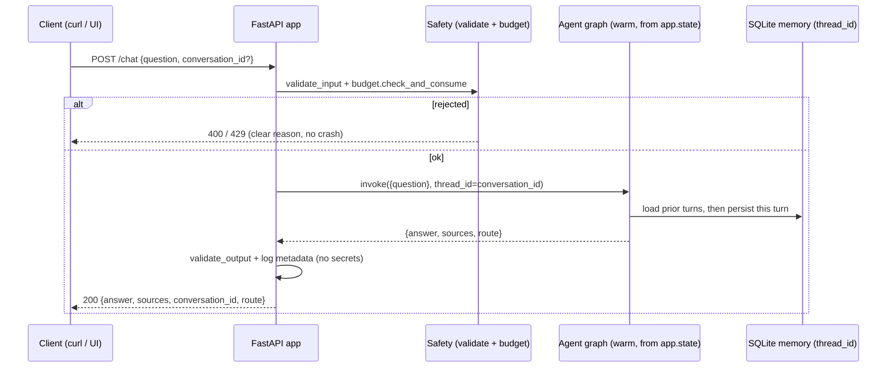

# Module 21 Concepts — From a Script to a Service

Every module before this one produced something you *run*: a CLI, a test, a
report. Useful, but a script has a fatal property for a company-wide assistant —
**it only exists while someone is running it**. This module changes the shape of
the deliverable. You will not hand IT a `.py` file; you will hand them a service
they can start once and leave running, monitor, put behind a load balancer, and
redeploy without you in the room.

## 1. The gap between a script and a service

| A script | A service |
|---|---|
| Starts, does one thing, exits | Starts once, stays up, answers many callers |
| Loads its index every run | Loads its index **once**, reuses it for every request |
| Failure = a traceback on someone's terminal | Failure = a clean HTTP status a caller can handle |
| "Is it working?" = ask the person who ran it | "Is it working?" = `GET /health`, `GET /ready` |
| Config = whatever was on that laptop | Config = environment variables, per deployment |
| Output = printed once | Output = streamed to whoever asked, live |

The agent logic does not change — you built it in Modules 14–20. What changes is
the *envelope*: an HTTP boundary, a lifecycle, health signals, config, logging,
and a way to package and ship it. That envelope is this module.

## 2. FastAPI application structure + the lifespan handler (load once)

A FastAPI app is a set of endpoint functions decorated with the HTTP method and
path they serve (`@app.post("/chat")`). The single most important production
decision is **where expensive setup happens**.

The wrong way — building the index/graph inside the request handler — rebuilds it
on *every* call. Under load, the service spends all its time re-indexing and falls
over.

The right way is a **lifespan handler**: an `async` context manager passed to
`FastAPI(lifespan=...)`. The code *before* its `yield` runs exactly once at
startup; the code *after* runs at shutdown. We build the vector index and compile
the agent graph there and stash them on `app.state`, so every request reuses one
warm graph:

```python
@asynccontextmanager
async def lifespan(app: FastAPI):
    app.state.agent = build_agent()  # index + graph, built once
    app.state.ready = True  # now readiness can flip to 200
    yield
    app.state.ready = False  # shutdown


app = FastAPI(lifespan=lifespan)
```

> **Misconception:** "module-level globals are simpler than a lifespan handler."
> They run at *import* time — which happens during test collection, in a worker
> that may never serve traffic, and before the app can report *not-ready*. The
> lifespan hook is the seam an orchestrator's startup probe watches; a global
> gives you nowhere to say "still warming up." (This is exactly why FastAPI's
> `TestClient` only runs the lifespan inside a `with TestClient(app):` block — a
> detail the tests in `tests/test_api.py` lean on.)

## 3. A streaming chat endpoint with Server-Sent Events

A non-streaming `/chat` computes the whole answer, then returns it — the caller
waits, then gets everything. **Server-Sent Events (SSE)** let the server push a
stream of text frames over one long-lived HTTP response, so a UI can render the
agent's progress as it happens.

The wire format is dead simple and line-oriented — an optional `event:` name, a
`data:` payload, and a blank line ending each frame:

```text
event: route
data: {"node": "router", "summary": "route selected: retrieval"}

event: answer
data: {"answer": "...", "sources": ["hr-remote-work"], "conversation_id": "..."}
```

In FastAPI you return a `StreamingResponse(generator, media_type="text/event-stream")`
whose generator `yield`s those frames. Crucially, we **reuse**
`techcorp_agent.streaming.stream_agent_events` — the same normalizer the CLI used
in Module 16 — and just re-encode each `AgentEvent` as an SSE frame. Streaming is
a *delivery* choice; the answer is identical to what `/chat` would return.

> **Trade-off:** SSE is one-way (server→client), text-only, and rides plain HTTP —
> which is exactly why it is the right first choice: `curl -N` can read it, no
> WebSocket handshake, no extra protocol. If you needed bidirectional streaming
> (client sending mid-turn), you would reach for WebSockets and pay the added
> complexity.

## 4. Health vs readiness — two different questions

These are *not* the same probe, and conflating them causes real outages.

- **Liveness (`/health`)** answers *"is the process alive?"* It must be cheap and
  dependency-free — it must not touch the index or the model. An orchestrator uses
  a failing liveness probe to decide to **restart** the pod. If `/health` did a
  real query, a slow dependency would look like a dead process and trigger a
  restart loop.
- **Readiness (`/ready`)** answers *"can it actually serve yet?"* It returns `200`
  only once the lifespan handler has finished building the index, and `503` while
  warming up. A failing readiness probe pulls the instance out of the load
  balancer **without killing it** — traffic waits for a warm instance instead of
  hitting a cold one.



## 5. Configuration for different environments

The same image must run on a laptop (offline, mock LLM), in CI (offline, forced),
and in production (real model, mounted volume) — with **no code change**. That is
what environment variables buy you. The service reads `TECHCORP_OFFLINE`,
`OPENAI_API_KEY`, `OPENAI_MODEL`, and `TECHCORP_MEMORY_DB` from the environment
(via `Settings` and `os.environ`); Compose feeds them from `.env`. The default is
offline and self-contained so a clean machine boots the service with zero setup.

## 6. Structured logging without secrets (Module 20's PII rule, applied to logs)

A log line is data that leaves the process — it goes to a central store many
people can read. So the same discipline you learned for guardrails applies: **log
metadata, never content or secrets.** The service logs a request id, the chosen
route, latencies, and the *lengths* of the question and answer — never the
question text, the answer text, or any API key. If you would not paste it into a
shared Slack channel, it does not belong in a log line.

```python
log_event(
    "chat.answered",
    request_id=rid,
    route="retrieval",
    question_chars=31,
    answer_chars=297,
    source_count=1,
)
# never: log.info(f"user asked: {question}")   # leaks user content
```

## 7. Docker packaging + Compose with a persistent vector-store volume

- **Multi-stage Dockerfile.** A `builder` stage uses `uv` to install the locked
  dependencies and the project into a venv; a slim `runtime` stage copies just the
  venv and the source and runs Uvicorn as a **non-root** user. Splitting stages
  keeps `uv` and its caches out of the shipped image (smaller, narrower attack
  surface). `EXPOSE 8000` and a `HEALTHCHECK` hitting `/health` make the container
  self-describing.
- **Compose + a named volume.** The vector index (`.chroma`) and the conversation
  DB are *stateful*. Without a volume, `docker compose down` throws them away and
  the next boot re-indexes from scratch. A named volume (`chroma-data:/app/.chroma`)
  makes the index **survive restarts** — the persistence lesson made physical.
- **Docker is optional.** Every artifact is written so `uv run uvicorn
  apps.api.main:app` works with no container at all. The Dockerfile is a shipping
  format, not a dependency of the lab.

## 8. CI: run the offline suite on every change

`.github/workflows/ci.yml` runs on every push/PR: set up `uv` + Python 3.12,
`uv sync`, `ruff check`, `ruff format --check`, then `pytest -q`. Because the
whole suite is offline (mock adapters, no `live` marker selected, no secrets), CI
is deterministic and free — the exact suite a learner runs locally is the gate on
the repository. The uv cache is keyed on `uv.lock` so unchanged dependencies are
not re-downloaded.

## 9. Trade-off to carry forward: in-process index vs external vector DB

This service keeps the Chroma index **in-process**, persisted to a local volume.
That is the right call for a teaching service and a single-instance deployment:
zero extra infrastructure, no network hop, trivially offline. It does **not**
scale horizontally — three replicas would each hold their own copy of the index
and their own memory DB, and they would drift. At real scale you would externalize
both: a managed vector database (so every replica queries one shared index) and a
shared conversation store (so a user's thread is visible from any replica). The
seam is already here — `build_agent()` and `TECHCORP_MEMORY_DB` are the two places
that would point at external services instead of local files. Knowing *when* the
in-process choice stops paying off is the senior judgment this module is really
teaching.

## The request path, end to end


