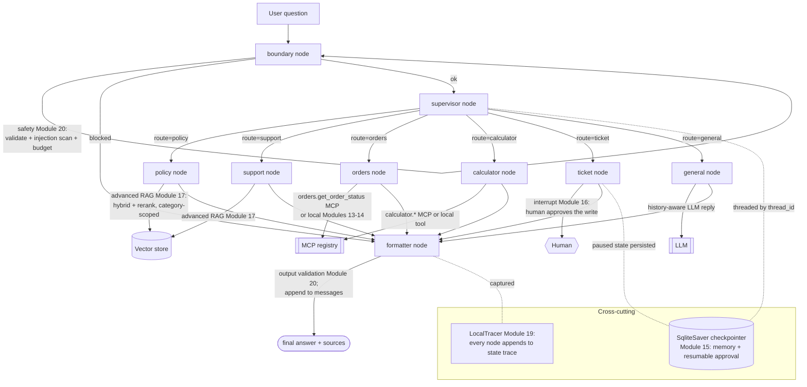

# Module 22 Concepts — Integrating the Whole Course

Read this before the lab. Module 22 introduces almost no *new* code. Its concept
is **integration**: how twenty-one modules of components become one production
agent, and what properties that integration must have to be shippable — and
defensible in an interview.

v1 (Module 14) taught **composition**: assemble Modules 02–13 into a router-and-
formatter graph. v2 teaches **integration**: take that graph and wire in every
Level-4 capability *at the joint where it belongs*, without editing any of the
packages it reuses.

---

## 1. The architecture: one graph, every module

Here is the v2 architecture, with the real node names and packages from
`src/techcorp_agent/capstone_v2/graph.py`:

Read the flow as five bands:

1. **boundary** — the untrusted edge. Input validation, an injection scan, and
   the budget hard-limit run *before* any model call. A blocked turn short-
   circuits to the formatter with a safe answer. (`safety/`, Module 20.)
2. **supervisor** — the multi-agent router. It picks exactly one route: a
   knowledge specialist (policy/support via the Module 18 `SupervisorAgent`), a
   deterministic tool (calculator/orders), the write action (ticket), or a
   general reply. (`agents/`, Module 18.)
3. **route nodes** — each capability. Policy/support use *category-scoped hybrid
   retrieval + reranking* (Module 17); orders/calculator use *MCP with graceful
   local fallback* (Modules 13–14); ticket *pauses for human approval* (Module
   16); general is a plain reply.
4. **formatter** — one output shape, output validation, and it appends the
   assistant turn to `messages` so the next turn sees it.
5. **cross-cutting** — the whole graph is compiled with a `SqliteSaver` so
   conversations and pending approvals persist (Module 15), and every node
   appends to `state["trace"]` so a run can be captured to disk (Module 19).

---

## 2. What "production" means here vs v1

| Property | v1 (Module 14) | v2 (Module 22) |
|---|---|---|
| Routing | one router node, keyword/LLM | multi-agent supervisor + specialists |
| Retrieval | plain vector top-k | hybrid (BM25+vector) + rerank, category-scoped |
| Memory | in-process list, forgotten on exit | `SqliteSaver`, survives restart, summarized |
| Streaming | none | CLI event feed **and** HTTP Server-Sent Events |
| Writes | none (all read-only) | ticket creation **behind human approval** |
| Safety | none | input validation, injection block, budget, output validation |
| Observability | dev trace only | dev trace **plus** persisted run traces + eval report |
| Delivery | a CLI script | a CLI **and** a FastAPI service (health/ready/chat/stream) |

Every row is a package you already built. v2 is the wiring, not the parts.

---

## 3. The integration decisions and their trade-offs

Every join in the diagram was a decision. The point of a hero capstone — and of
the interview it prepares you for — is to defend each with a trade-off, not a
slogan.

### Advanced RAG on or off (`advanced_rag=True`)

- **On** (the default): hybrid search + reranking. The Module 17 report measured
  this took **paraphrase retrieval from 60% to 100%** offline — the exact win v2
  ships. Cost: a BM25 index to build and a reranking pass per query.
- **Off**: plain vector top-k, identical to v1. Cheaper, simpler, and on a
  *live* sentence-transformer corpus the Module 17 report found hybrid/rerank did
  **not** move the needle. So the honest default is "on offline (hash embeddings
  need the help), measure before assuming it helps live." The `advanced_rag` flag
  exists so you can toggle and compare — the lab's stretch.

### Multi-agent cost (the supervisor's routing LLM call)

The `SupervisorAgent` spends **one LLM call to route** before a specialist
answers. That is a real token cost v1's keyword router did not pay. The
trade-off: focused specialist prompts (each describes only its slice) mean less
prompt bloat and fewer confusions — but you pay a routing call and added latency.
Module 18's comparison harness is how you decide whether the trade is worth it on
your traffic; v2 keeps synthesis *off* (pass-through + attribution) so it does not
pay a *second* call to reword an already-correct answer.

### Memory footprint (SqliteSaver + summarization)

Durable memory means the whole state — including the growing `messages`
transcript — is written to SQLite every turn. Two costs: disk, and a prompt that
grows with the conversation. Module 15's **summarization** caps the second: older
turns are summarized under a token budget so the prompt stays bounded. The
trade-off is fidelity (a summary loses detail) vs cost (an unbounded transcript
is expensive and eventually overflows the context window).

### Approval friction (the ticket interrupt)

Gating the ticket write behind a human `interrupt()` is friction on purpose:
every ticket costs a round-trip to a person. The rule (Module 16) is that
**writes, escalations, and spending** deserve a gate; **reads do not**. So only
the ticket route interrupts — retrieval, calculator, orders, and general stay
un-gated. The trade-off is safety (no hallucinated ticket reaches a real support
queue) vs speed (an approved ticket waits for a human).

### Safety overhead (the boundary node)

The boundary runs on every turn: validate the question, scan for injection,
check the budget. It is cheap and deterministic (no model call), but it *can*
false-positive — an over-eager injection filter refuses a legitimate question.
v2's filter uses a defensible starter pattern set and refuses only blatant direct
injections; injection *planted in retrieved documents* is a different vector,
caught downstream by the **hardened specialist prompts** and **output
validation**. Defense-in-depth means no single layer has to be perfect.

---

## 4. Composition, not reimplementation (the reuse contract)

The one law of this module: `capstone_v2/` **imports** every capability and
reimplements none. Concretely:

- The knowledge nodes reuse the Module 18 specialist prompts (`_POLICY_PROMPT`,
  `_SUPPORT_PROMPT`) and the Module 17 `hybrid_search` + `OverlapReranker`.
- The orders/calculator nodes reuse the Module 13 MCP bridges (`_try_mcp_order`,
  `_try_mcp_calculator`) and the local tools.
- The ticket node reuses the Module 16 `create_ticket` and `interrupt`.
- The boundary reuses Module 20's `validate_question`, `detect_injection`,
  `harden_system_prompt`, `validate_answer`, and `SessionBudget`.
- The checkpointer reuses Module 15's exact `SqliteSaver` construction.
- The report reuses Module 19's `run_experiment` and Module 09's metrics.

If you find yourself *rewriting* a capability in `capstone_v2/`, stop — the reuse
is the deliverable. New code belongs only at the **joints**: the graph wiring,
the `V2State`, the `ScopedRetriever` that combines category scope with advanced
retrieval, and the thin CLI/API/report glue.

---

## 5. Common misconceptions

**"v2 is a bigger, better rewrite of the agent."** No. v2 is the *same* agent
with the Level-4 packages wired in. A rewrite would violate the course's core
rule (build progressively) and throw away twenty-one modules of tested code.

**"Multi-agent is automatically better than one router."** No — it costs a
routing call and latency. It wins when specialist focus reduces confusion enough
to pay for itself, which you *measure* (Module 18), not assume.

**"Advanced retrieval always helps."** No. The Module 17 report is a real
negative result on the live corpus: hybrid/rerank helped hash embeddings a lot
and the sentence-transformer corpus not at all. Ship it where it is measured to
help; keep the toggle.

**"The approval gate should cover every tool."** No — reads do not need approval.
Gating retrieval or a calculator would add friction with no safety benefit. Gate
the *write*.

**"Offline metrics are the real metrics."** No. With the mock LLM only the
*retrieval* numbers are meaningful; generation-side quality describes the mock.
The report says so out loud — honest caveats are part of the deliverable.

**"Memory means the model remembers everything."** No. Memory is state persisted
by a checkpointer and *summarized under a budget*; the model sees a bounded recap
of prior turns, not an unbounded transcript.

---

## 6. Trade-offs to be able to state out loud

- Advanced retrieval quality vs index-build + rerank cost (and "measure before
  assuming it helps live").
- Multi-agent focus vs the routing call's tokens and latency.
- Memory durability + continuity vs disk and prompt growth (mitigated by
  summarization).
- Approval safety vs the round-trip friction of a human in the loop.
- Safety coverage vs false-positive risk (mitigated by defense-in-depth).
- One integrated service (simple to deploy) vs many small services (independently
  scalable) — v2 ships one; the diagram shows where you'd split it.
